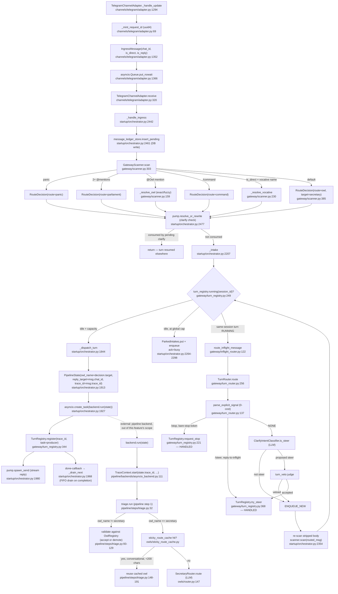

# Channel Adapters → Gateway Ingress Routing

## Sources consulted

- `src/stackowl/channels/base.py` (1-204, full) — `ChannelAdapter` ABC
- `src/stackowl/channels/telegram/adapter.py` L1-1368 — `_mint_request_id` L69-80, `receive()` L320-332, `_handle_update()` L1294-1368
- `src/stackowl/channels/cli_adapter.py` L1-170 — `_next_request_id()` L125-144, `receive()` L154-171
- `src/stackowl/gateway/scanner.py` (full, 386 lines) — `IngressMessage` L53-90, `GatewayScanner.scan()` L303-385
- `src/stackowl/gateway/turn_router.py` (full, 354 lines) — `parse_explicit_signal()` L137-218, `TurnRouter.route()` L256-332
- `src/stackowl/gateway/turn_registry.py` (full, 815 lines)
- `src/stackowl/gateway/inflight_router.py` (full, 236 lines) — `route_inflight_message()` L122-235
- `src/stackowl/startup/orchestrator.py` L90-229, L1420-1499, L1834-2500 — `_dispatch_turn`, `_drain_next`, `_intake`, `_handle_ingress`
- `src/stackowl/pipeline/steps/triage.py` (full, 233 lines)
- `src/stackowl/pipeline/backends/asyncio_backend.py` L95-149

## Concrete findings

**Trace/id minting** happens at the channel adapter (Telegram's `_mint_request_id()`, `uuid4().hex`; CLI's `_next_request_id()`, `f"cli-{session[:8]}-{counter}"`) — but `TraceContext.start(...)` (the contextvar that actually back-propagates into every log line) is called LATER, inside the pipeline backend's `run()` (`asyncio_backend.py:111`), using the already-minted `state.trace_id`. Minting and TraceContext-binding are two separate steps.

**CLAUDE.md discrepancy confirmed**: it says "Every user message mints a UUIDv4 trace_id at the channel adapter via `TraceContext.start(...)`" — the UUID minting is at the adapter, but `TraceContext.start()` itself only runs inside the pipeline backend. Not a bug, a documentation phrasing gap.

**Durability**: `_handle_ingress()` (`orchestrator.py:2442`) writes a `message_ledger_store.insert_pending(...)` row BEFORE the message touches any in-memory structure — this is what makes an inbound message durable at arrival. `TurnRegistry`/`ParkedIntakes` are in-memory only.

**Primary happy path** (Telegram, idle session, plain text):
1. `TelegramChannelAdapter._handle_update()` mints trace_id, builds `IngressMessage`, queues it.
2. `.receive()` pops it off.
3. `_handle_ingress()` inserts the ledger row, then `scanner.scan(msg)`.
4. `GatewayScanner.scan()` — priority: panic → multi-@mention parliament → `@Owl` (exact/fuzzy) → `/command` → (DM only) bare-name vocative → default `RouteDecision(route="owl", target="secretary")`.
5. `pump.resolve_or_rewrite(...)` checks for a pending clarify reply.
6. `_intake(...)` — idle session under capacity → `_dispatch_turn(...)`.
7. `_dispatch_turn` builds `PipelineState(owl_name=decision.target, ...)`, `asyncio.create_task(backend.run(state))`.
8. `turn_registry.register(...)` tracks the in-flight turn; a completion callback drains the next queued intake.
9. Response streams back through the same adapter's `send()`.
10. Inside `backend.run(state)`, the first pipeline step is `triage.run()` — owl routing is finally resolved for the ambiguous "secretary" case.

**Answer to "single decision point or multiple?" — two sequential layers, not duplication:**
1. **`GatewayScanner.scan()`** — fast, deterministic, non-LLM. Only fires for explicit structural signals (`@OwlName`, DM-only bare vocative). Sets `RouteDecision.target`. Everything else falls through to `"secretary"`.
2. **`triage.run()`** (first pipeline step): if `owl_name != "secretary"` (scanner made an explicit decision) → triage only VALIDATES against the registry, never overrides. If `owl_name == "secretary"` (scanner deferred) → triage's FR-9 sticky-cache or `SecretaryRouter` (LLM) makes the actual semantic decision.

Clean precedence chain: scanner.py is authoritative for explicit addressing; triage.py's router is authoritative only when scanner deferred. Not "made and re-made."

3. **`TurnRouter`** is NOT a "which owl" decision at all — it only fires when a turn is already RUNNING for the session, deciding STOP/STEER/NEW. A NEW verdict causes a re-scan reusing `scanner.py`'s own logic, not a third decision engine.

**Error/fallback branches**: unknown `@Owl` → fuzzy match + suggestion; ambiguous vocative → default secretary; global capacity → parked/busy ack; per-session queue full → overflow ack + ledger mark_failed; providers degraded → floors before `backend.run()`; router/veto exceptions fail-safe to NEW.

## Mermaid

External dependency: `backend.run(state)` is the boundary of this feature.

## Confidence note + known gaps

High confidence — every hop read from source. Did not trace `ClarifyGateway`/`ClarifyPump.resolve_or_rewrite` internals in depth (fallback path, not primary happy path). Did not open Slack/Discord/WhatsApp adapters directly — grep confirmed they funnel through the same `_handle_ingress`/`scanner`/`turn_router`/`turn_registry` machinery at the same call sites in `orchestrator.py`. `GatewayLink`/`SocketTurnClient` (split gateway/core socket-forwarding transport) noted but not expanded — orthogonal to routing logic.
