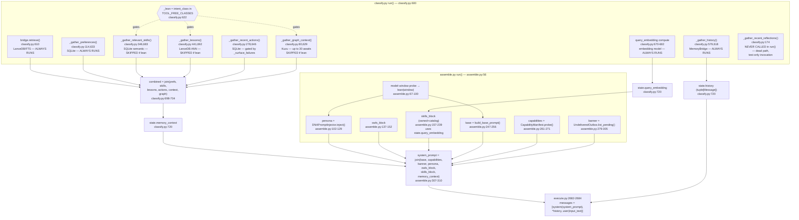

# Classify / Context Assembly

## Sources consulted

- `src/stackowl/pipeline/steps/classify.py` (full, 720 lines)
- `src/stackowl/pipeline/steps/assemble.py` (full, 322 lines)
- `src/stackowl/pipeline/state.py` L18 (`TOOL_FREE_CLASSES`), L71-84
- `src/stackowl/pipeline/registry.py` L37
- `src/stackowl/pipeline/steps/execute.py` L2682-2684 (final message assembly)

## Concrete findings — gather-function inventory

**classify.py — 7 named `_gather_*` helpers + 2 unnamed inline fetches, all in one `run()` (L600-720):**

| # | Function | Line | Source | Always run? |
|---|----------|------|--------|--------------|
| 1 | `bridge.retrieve(...)` (inline) | L610 | LanceDB/FTS committed facts | **Yes** — before `_lean` computed |
| 2 | `_gather_history` | L579/618 | `MemoryBridge.recent_conversation_turns` | **Yes** — before `_lean` computed |
| 3 | `_gather_graph_context` | L80/629 | Kuzu — up to 30 sequential awaits (5 tokens × 6 entity types) | Skipped when lean |
| 4 | `_gather_preferences` | L114/633 | SQLite (global + owner, 2 calls) | **Yes — no lean gate at all** |
| 5 | `_gather_recent_reflections` | L174 | SQLite + optional embed | **Dead in `run()`** — comment says no longer invoked from assembly, test-only |
| 6 | `_gather_recent_actions` | L278/646 | `TaskOutcomeStore` (SQLite) | Gated by `_should_surface_failure_history`, which excludes `TOOL_FREE_CLASSES` too but is its own separate gate |
| 7 | query-embedding compute (inline) | L670-682 | embedding model | **Yes — explicitly NOT gated on lean** (assemble needs it independently) |
| 8 | `_gather_relevant_skills` | L346/683 | SQLite semantic recall (reuses #7's embedding if precomputed) | Skipped when lean |
| 9 | `_gather_lessons` | L441/692 | LanceDB ANN, retried once | Skipped when lean |

Plus owned-skill-name lookup (L654-663, in-memory, skipped when lean).

**assemble.py — ~7 more distinct fetch/compute blocks fanning into the same prompt:**

| Block | Line | Source |
|---|---|---|
| Model-window probe → **its own separate `lean`** (window-based, different from classify's `_lean`) | L67-100 | provider config / live probe |
| Persona injection | L102-129 | `owl_registry.get()` + `DNAPromptInjector` |
| `owls_block` | L137-152 | `owl_registry.list()` |
| `skills_block` (owned + catalog) | L157-239 | up to 3 SQLite strategies |
| `base` prompt | L247-256 | in-memory |
| `capabilities` | L261-271 | live reachability probe |
| `banner` (undelivered outbox) | L279-305 | SQLite, gated on `delegation_depth==0` |

## Lean short-circuit — confirmed, and it's actually FOUR independent lean-adjacent gates

`classify.py`'s `_lean = state.intent_class in TOOL_FREE_CLASSES` (L622) gates: `_gather_graph_context`, owned-skill lookup, `_gather_relevant_skills`, `_gather_lessons`. NOT gated: `bridge.retrieve`, `_gather_history`, `_gather_preferences`, query-embedding compute. `_gather_recent_actions` has its own separate gate (`_should_surface_failure_history`). `_gather_recent_reflections` is dead code in the live path.

`assemble.py` has its OWN separate lean concept (window-based `LEAN_WINDOW_THRESHOLD`, used only for persona depth + `build_base_prompt`), AND independently re-checks `state.intent_class not in TOOL_FREE_CLASSES` three MORE times (`skills_block` L172, `describe_tool_protocol` L249, `capabilities tools_enabled` L264) — same signal classify already derived, re-derived rather than passed through as one decision. **Four separate lean-adjacent branches across two files, not one shared decision.**

## assemble.py → execute.py fold

`assemble.run()` (L307-310) joins `(base, capabilities, banner, persona, owls_block, skills_block, state.memory_context)` with `"\n\n"` into `system_prompt`. `execute.py` L2682-2684: `messages = [*state.history, Message(role="user", content=state.input_text)]`, then prepends `Message(role="system", content=state.system_prompt)`. `state.history` (real `Message` turns from `_gather_history`) is deliberately NOT folded into the text block — spliced in as actual conversation turns instead.

## Mermaid

## Confidence note + proportionality assessment

High confidence — both files read in full, fan-in cross-checked against `state.py` and `execute.py`. Known gap: `MemoryBridge.retrieve()`/`recent_conversation_turns()` internals, `CapabilityManifest.probe()`'s sub-probes, and `resolve_window()`'s I/O shape were not traced deeper — each represents further fan-out inside a single line of classify/assemble, so the true I/O count per turn is higher than the 9+7 top-level calls counted here.

**Proportionality: strong candidate for splitting.** classify.py has 7 named gather functions (one dead) plus 2 always-run inline fetches; assemble.py adds ~7 more independently-sourced blocks. Four different lean-adjacent branches exist across the two files instead of one shared decision. A `standard`-intent, non-lean turn sequentially fans out to LanceDB, SQLite (×3 stores), Kuzu (≤30 calls), and an embedding model in classify alone, then assemble adds provider selection, a second SQLite skill-catalog fan-out, and a live capability probe — all `await`ed sequentially, not gathered concurrently via `asyncio.gather` anywhere in either file.
