# Delivery Gates / Honesty Floors

**Contains a verified, reproduced bug — see Finding 4. This is a real defect candidate, not just a documentation gap.**

## Sources consulted

- `src/stackowl/pipeline/backends/shared.py` (399 lines, full) — `run_delivery_gate` L96-141, `_capture_outcome` L208-399
- `src/stackowl/pipeline/steps/deliver.py` (232 lines, full)
- `src/stackowl/pipeline/delivery_gate.py` (1595 lines, full, two passes) — all 5 gates
- `src/stackowl/pipeline/turn_persist.py` (242 lines, full)
- `src/stackowl/pipeline/steps/classify.py:160-171,278-343,630-715`
- `src/stackowl/pipeline/backends/asyncio_backend.py:200-315`
- `src/stackowl/pipeline/state.py:240-360`
- `tests/pipeline/test_persistence_handoff.py` (full)
- A standalone repro script against the real (non-test-double) functions to confirm the suspected cross-gate bug

## Gate order (`run_delivery_gate`, shared.py:96-141)

1. `surface_applied_lessons` — not an honesty gate
2. `surface_recovery` — not an honesty gate
3. `surface_persistence_handoff` (delivery_gate.py:1475) — before flooring, hand the whole request to a capability-matched better-fit owl
4. `surface_consequential_giveup_floor` (delivery_gate.py:329) — replace a dressed-up give-up with a deterministic honest floor
5. `surface_overclaim_gate` (delivery_gate.py:918) — block confident-but-empty / cited-unretrieved / promised-schedule-never-ran drafts
6. `surface_grounding_gate` (delivery_gate.py:617) — strip or floor fabricated citations
7. `surface_critical_failure` (delivery_gate.py:1311) — inject localized apology when CRITICAL `execute` step failed with no response
8. `surface_command_hint` — cosmetic

Then `persist_turn` runs (still inside `run_delivery_gate`). Outside it, `_capture_outcome` writes `task_outcomes` from the POST-gate state.

## Per-gate: trigger + fix-vs-floor

- **`surface_persistence_handoff`**: tries to fix — one bounded A2A delegation round-trip to a better-fit owl, delivers the child's real answer on success.
- **`surface_consequential_giveup_floor`**: NO fix attempt — straight to deterministic floor text.
- **`surface_overclaim_gate`**: triggers 1/2 (unverified effect / structural) → straight to floor. Trigger 3 (retrieval-intent, no lookup ran) → tries `_try_corrective_rerun` (one bounded pipeline re-run with rejection fed back). Trigger 4 (promised schedule, no cronjob call) → tries `ScheduleCommitFulfiller` (actually mints the job, appends a truthful receipt on success).
- **`surface_grounding_gate`**: zero sources fetched → tries `_try_corrective_rerun`. Some sources fetched → strips fabricated URLs only (no floor) unless stripping guts the answer.
- **`surface_critical_failure`**: NO retry of the failed action — generates a FRESH one-sentence apology via provider tier-cascade, falling to a neutral marker only if every tier fails. "Try a different provider to phrase an apology," not "try to fix the underlying failure."

## Does a gate firing become visible to the model itself? YES, partially, same-session, via table indirection

Gate fires → `state.responses` replaced → `persist_turn` computes `_turn_floored` → on floor: evicts sticky-cache, upserts `retry_queue` row, flips `message_ledger.mark_failed`, stores ONLY the user utterance to memory_bridge (`trust="untrusted"`, never the dressed-up prose — anti-laundering LM-3). Separately, `_capture_outcome` writes `task_outcomes`: `response_text` = the actual floor/apology text, `success = trustworthy_success` (false whenever `unrecovered_effects` or a refuted acceptance verdict exists), `failure_class = "unachieved_effect"` in that case, `overclaim_blocked` = the gates' own stamped flag.

Next turn, SAME session: `classify.py:_gather_recent_actions` reads this row and folds a `## What You Did Recently` block into the prompt — the model reads its own recent floor text back.

**Caveats**: session-scoped + last-3-only, not durable cross-session. A PURE grounding-gate floor (fabricated citations, nothing else wrong) does not set `unrecovered_effects`, so `trustworthy_success` computes `True` and the row shows `✔` even though `response_text` is literally the apology — the coarse success/failure signal is misleading for that specific gate. `surface_critical_failure`'s firing sets no distinct flag — visibility rides entirely on the underlying step error already in `state.errors`. The `retry_queue`/`message_ledger` state is NOT model-visible at all — drives background automation and human-facing state only.

## Finding 4 — REAL BUG: `surface_persistence_handoff`'s fix is discarded by the very next gate

`delivery_gate.py`'s own module docstring (L1403-1408) claims a successful hand-off replaces the responses so the giveup-floor gate "no longer sees a give-up and no-ops." **Verified false in production shape.** `surface_persistence_handoff`'s success path returns `state.evolve(responses=(chunk,))` — it evolves the ORIGINAL state, not a cleared copy, so `consequential_failures`/`recovered_consequential` (stamped by `execute`'s snapshot BEFORE delivery gates run) carry through unchanged. The very next gate, `surface_consequential_giveup_floor`, calls `decide_delivery(state)` purely off those ledger fields — never inspecting `state.responses` — and RE-DETECTS the same give-up, overwriting the hand-off's real answer with the honest floor.

Reproduced against real (non-test-double) functions with a production-shaped `PipelineState` (`consequential_snapshot_taken=True`):
```
AFTER HANDOFF:           "It is 24C and sunny." (is_floor: [False])
AFTER GIVEUP-FLOOR GATE:  "I couldn't fully complete this: ... The capability that failed: send_email..." (is_floor: [True])
```
`tests/pipeline/test_persistence_handoff.py` only unit-tests the handoff in isolation, never chained into the giveup-floor gate — this gap has zero test coverage. **This means the only "try-to-fix" rung that isn't a mechanical retry/tool-call (the never-give-up hand-off) is currently inert whenever `execute` stamped a consequential snapshot — the normal production path.** Not fixed here (out of this research task's scope) — flagged as a P0 fix candidate for the user to decide on.

## File-boundary (delivery_gate.py vs deliver.py)

`delivery_gate.py` (1595 lines) is an admitted-intentional physical merge of 5 formerly-separate files (its own header says so) — owns the DECISION layer (is the draft trustworthy, what honest text replaces it). `deliver.py` (232 lines) owns the TRANSPORT layer (writing accepted chunks to StreamRegistry/StreamWriter) PLUS one unrelated concern: enforcing the owner's `OutputStyle` (`_enforce_output_prefs`), which rewrites `state.responses` content much like a 6th gate would — but for STYLE, not honesty. No functional overlap found, but `deliver.py`'s style transform is conceptually a 6th "last-mile gate" that isn't counted among "the 5" and isn't cross-referenced by either module — worth naming explicitly.

## Mermaid

```mermaid
flowchart TD
    A["shared.py:96 run_delivery_gate()<br/>entry, in fixed order"] --> B["surface_applied_lessons<br/>(not an honesty gate)"]
    B --> C["surface_recovery<br/>(not an honesty gate)"]

    C --> D["delivery_gate.py:1475<br/>surface_persistence_handoff<br/>trigger: would give up"]
    D -->|"TRY-FIX: capability-match a better owl,<br/>one A2A round-trip, deliver its real answer"| D2["hand-off delegate()"]
    D2 -->|success| D3["responses = child's answer<br/>(is_floor=False)"]
    D2 -->|fail / no target| D4["responses untouched"]

    D3 --> E["delivery_gate.py:329<br/>surface_consequential_giveup_floor<br/>trigger: unrecovered consequential<br/>failure OR no-progress spiral"]
    D4 --> E
    E -->|"NO fix attempt — decide_delivery()<br/>reads state.consequential_failures,<br/>ignores state.responses"| E2{"BUG (verified by repro):<br/>re-detects the SAME give-up<br/>D3's real answer discarded"}
    E2 -->|give-up detected| E3["responses = deterministic floor<br/>(is_floor=True)"]
    E2 -->|clean| E4["responses untouched"]

    E3 --> F["delivery_gate.py:918<br/>surface_overclaim_gate<br/>4 triggers"]
    E4 --> F
    F -->|"trigger 1/2: unverified effect /<br/>structural — STRAIGHT TO FLOOR"| F1["floor"]
    F -->|"trigger 3: retrieval-intent —<br/>TRY-FIX: _try_corrective_rerun()"| F2["corrective pipeline re-run"]
    F -->|"trigger 4: schedule-commit —<br/>TRY-FIX: ScheduleCommitFulfiller"| F3["actually mint the cronjob"]
    F2 -->|fail| F1
    F3 -->|fail| F1

    F1 --> G["delivery_gate.py:617<br/>surface_grounding_gate<br/>trigger: fabricated citation URLs"]
    F2 -->|ok| G
    F3 -->|ok, receipt appended| G
    G -->|"zero sources fetched —<br/>TRY-FIX: _try_corrective_rerun()"| G1["corrective pipeline re-run"]
    G -->|"some fetched — strip only<br/>NO floor"| G2["strip fabricated URLs"]
    G1 -->|fail| G3["floor"]
    G2 -->|stripped answer gutted| G3

    G3 --> H["delivery_gate.py:1311<br/>surface_critical_failure<br/>trigger: CRITICAL execute step<br/>errored, no usable response"]
    G1 -->|ok| H
    G2 -->|not gutted| H
    H -->|"NO retry of failed action —<br/>generate NEW apology via<br/>provider tier-cascade"| H1["localized apology<br/>(or neutral marker if cascade dead)"]

    H1 --> I["surface_command_hint<br/>(cosmetic, non-honesty)"]
    I --> J["turn_persist.py:74 persist_turn()<br/>reads _turn_floored(state)"]
    J -->|floored| J1["retry_queue row +<br/>message_ledger.mark_failed +<br/>memory_bridge user-utterance-only, untrusted"]
    J -->|clean| J2["memory_bridge user+assistant, trust per merge"]

    J1 --> K["deliver.py:15 deliver.run()<br/>write to StreamRegistry"]
    J2 --> K
    K --> L["shared.py:208 _capture_outcome()<br/>POST-gate state → task_outcomes row<br/>success / failure_class / overclaim_blocked"]

    L -.same session, next turn.-> M["classify.py:278 _gather_recent_actions()<br/>TaskOutcomeStore.recent_for_session(limit=3)"]
    M --> N["## What You Did Recently<br/>injected into classify prompt context<br/>classify.py:698-703"]
    N -.visible to the model.-> D

    style E2 fill:#ffdddd,stroke:#cc0000,stroke-width:2px
    style D2 fill:#ddffdd
    style F2 fill:#ddffdd
    style F3 fill:#ddffdd
    style G1 fill:#ddffdd
    style H1 fill:#ffffcc
```



## Confidence note + known gaps

High confidence on gate order/triggers/fix-vs-floor classification (read directly, cross-checked against docstrings). High confidence on the visibility chain (traced end to end, not inferred). High confidence on the persistence_handoff bug — REPRODUCED against real functions, not just read statically.

Gaps: did not run the full pytest suite (targeted only, per house rule) so cannot rule out some other later-added guard neutralizing this bug in a path not found by grep — grepped ALL `run_delivery_gate`/`persistence_handoff` call sites and found only the two backends + one test file, so fairly confident no such guard exists, but worth a targeted test run before treating as ship-ready fact. Did not trace `langgraph_backend.py`'s gate cascade in the same depth — it calls the identical `run_delivery_gate` so the bug applies there too, but its own `_capture_outcome` state-threading wasn't verified as closely. Did not check whether `overclaim_blocked` is read anywhere else in the model-visible path.
