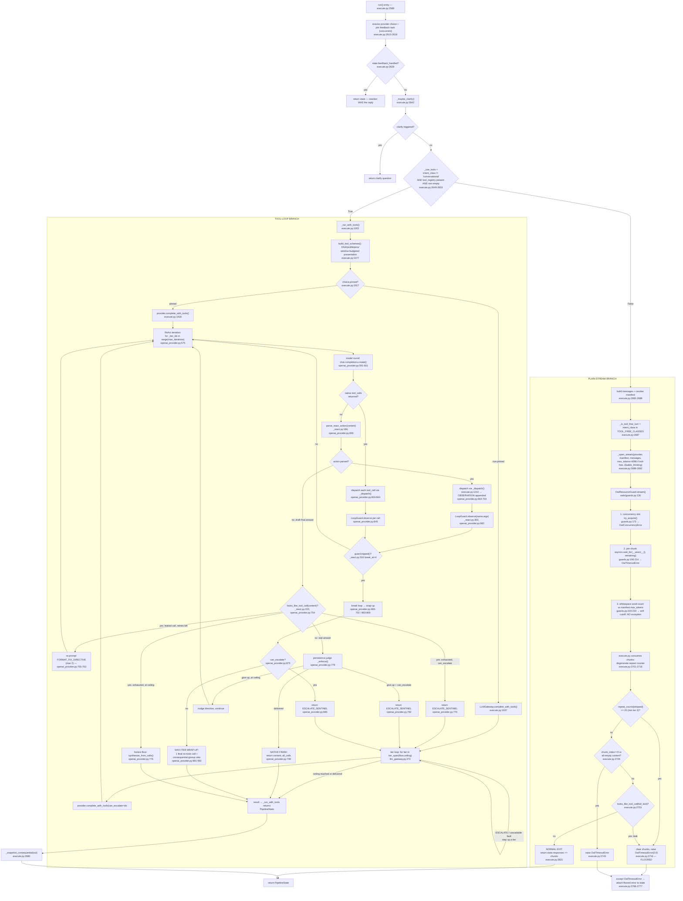

# Execute Step — Tool-Use ReAct Loop + Plain-Stream Path

execute.py is 2600+ lines, the largest file in the codebase — this is the core "message goes to the provider and comes back" logic, with two branches from one top-level decision.

## Mermaid

## Loop-detection/guard overlap analysis

Three distinct mechanisms in this feature, each covering a genuinely different failure mode (not redundant):
1. **`LoopGuard`** (`providers/_react.py:275`, `break_at=4`) — trips on the tool-loop branch when the SAME `(name, args)` tuple repeats — catches a model stuck re-calling the same tool.
2. **Degenerate-repetition counter** (`execute.py:2701-2716`, threshold=20, min-len=3) — trips on the plain-stream branch when the SAME short text unit repeats in the raw token stream — catches a model stuck emitting the same token/phrase (e.g. empty `<tool_code></tool_code>` pairs), a stream-level failure mode the tool-loop's `LoopGuard` cannot see (no tool calls involved at all).
3. **`OwlResourceGuard`'s word-count cutoff** (`guards.py:219-234`) — a soft client-side ceiling on total output length, unrelated to repetition — stops consuming once `manifest.max_tokens` (whitespace words) is crossed, no exception raised.

These three guards protect against three different pathologies (tool-call thrashing, stream-token thrashing, raw length) at two different layers (tool-loop vs plain-stream) — legitimate specialization, not duplication.

## Confidence note + known gaps

High confidence on: the top-level `_use_tools` condition, the full plain-stream guard stack, the openai_provider ReAct iteration mechanics and all four ESCALATE trigger sites, `LoopGuard`'s semantics, and the guard-overlap analysis — all backed by full reads.

Gaps: `anthropic_provider.py:183`'s `complete_with_tools` was located but not read in full — assumed to mirror the openai loop structure via the shared `ModelProvider` interface, not verified byte-for-byte (may implement leak-detection differently for Anthropic's native tool-call format). `execute.py:1290-1780` and `2100-2286` (~700 lines, the recovery-ladder tool-substitution logic, deeper `BudgetGovernor`/`ConsequentialActionGate` wiring) were only grepped, not read — there may be additional resource-budget guards (e.g. cost ceilings) not captured here. `llm_gateway.py:357+` and `1-227` (non-tools `.complete()` path) were grepped only. `_dispatch`'s full body past line 1290 (actual tool invocation, consent-prompt flow) not traced.
