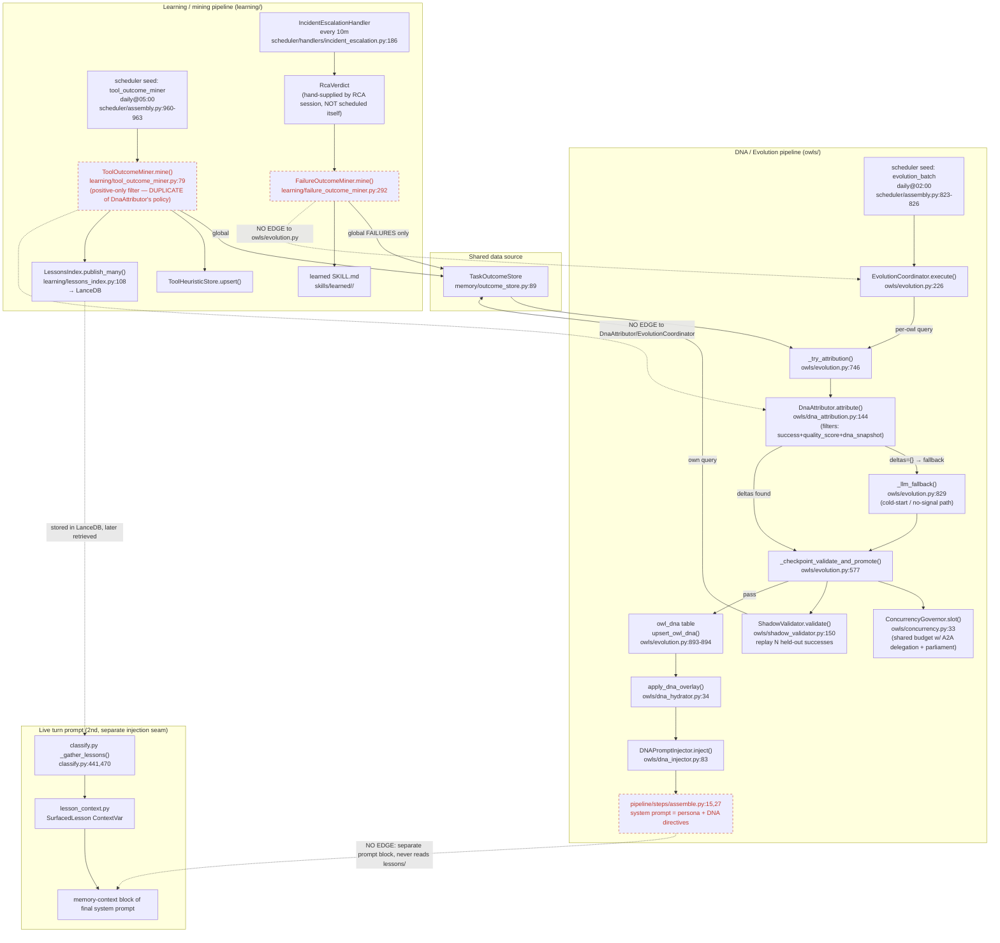

# Learning — DNA/Evolution + Failure/Tool-Outcome Mining

## Sources consulted

- `src/stackowl/owls/evolution.py` (full, 942 lines) — `EvolutionCoordinator`, `DeltaValidator`
- `src/stackowl/owls/shadow_validator.py` (full, 319 lines)
- `src/stackowl/owls/concurrency.py` (full, 109 lines) — `ConcurrencyGovernor`
- `src/stackowl/owls/dna_attribution.py` (full, 372 lines) — `DnaAttributor`
- `src/stackowl/owls/dna_injector.py` (full, 128 lines)
- `src/stackowl/owls/dna_hydrator.py` (full, 145 lines)
- `src/stackowl/scheduler/handlers/evolution.py`, `scheduler/assembly.py:790-963`
- `src/stackowl/learning/failure_outcome_miner.py` (full, 479 lines)
- `src/stackowl/learning/tool_outcome_miner.py` (full, 188 lines)
- `src/stackowl/learning/lessons_index.py:1-70`
- `src/stackowl/pipeline/lesson_context.py` (full, 112 lines)
- `src/stackowl/pipeline/steps/classify.py:440-487`, `assemble.py:1-60`
- `src/stackowl/memory/outcome_store.py:300,335,420`
- `src/stackowl/scheduler/handlers/incident_escalation.py:53-232`
- Cross-import grep both directions between `owls/` and `learning/`

## DEFINITIVE VERDICT

**Two independent, non-communicating pipelines that both mine `TaskOutcomeStore`, with ZERO code-level data flow between them.** Not legitimate layering (mining doesn't feed evolution, evolution doesn't feed mining), and not pure logic duplication either (different targets: personality traits vs. tool-usage knowledge) — but the *concern* ("make the owl better from past outcomes") and the *data source* are duplicated with no shared machinery.

**Evidence:**
- `owls/evolution.py`'s imports never reference `stackowl.learning.*`; grep across `learning/` for `stackowl.owls` imports: zero hits.
- `owls/learning_artifact_store.py` is a false cognate — a DNA+skill mutation checkpoint/restore table, unrelated to `learning/lessons_index.py`.
- Both `DnaAttributor` and `ToolOutcomeMiner` independently re-implement the SAME "positive-only learning" policy (never learn from failures) as two separate filter functions on two separate query methods:
  - Evolution: `TaskOutcomeStore.list_scored_for_owl()` — **per-owl**, requires `quality_score`+`dna_snapshot`
  - Tool mining: `TaskOutcomeStore.list_scored_for_owl_global()` — **global**
  - Failure mining: `TaskOutcomeStore.list_failed_global()` — the OPPOSITE half (failures only), explicitly documented as intentionally bypassing the critic's success-only queue
- No shared "Lesson → DNA" or "DNA-signal → Lesson" bridge. Three de facto separate learning subsystems, each delivering into the live turn through TWO DISJOINT prompt-injection seams:
  - Evolution mutates `OwlDNA` traits → `ShadowValidator`-gated → `upsert_owl_dna` → `DNAPromptInjector.inject()` in `assemble.py` — a **personality/behavior tuning** loop.
  - `ToolOutcomeMiner` writes `ToolHeuristicStore` + publishes `LessonDraft`s to `LessonsIndex` → `classify.py`'s `_gather_lessons` semantically searches it back into the memory-context block — a **retrieved-knowledge** loop.
  - `FailureOutcomeMiner` writes learned `SKILL.md` files under `skills/learned/`, gated on an externally-supplied `RcaVerdict` from `incident_escalation.py`'s staged RCA — a **capability-authoring** loop.
- Scheduling is independent, coordinated only by clock-slot spacing (not data dependency): `evolution_batch`@02:00, `skill_synthesizer`@03:30, `knowledge_prune`@04:00, `tool_outcome_miner`@05:00 — comment explicitly says these times avoid *collision*, not sequence a pipeline. `FailureOutcomeMiner.mine()` has NO scheduled cron entry at all — only invoked on-demand from `incident_escalation.py` (itself scheduled every 10m).
- Both `EvolutionCoordinator` and delegation/parliament share ONE `ConcurrencyGovernor` instance — real sharing, but a concurrency budget, not a learning-data connection. `learning/*.py` miners don't participate in it.

## Mermaid

## Confidence note + known gaps

High confidence on the verdict — verified both by full-file reads and a targeted zero-hit grep for cross-package imports in either direction. The "duplicated positive-only filter" claim is a direct line-level comparison.

Gaps: did not trace how `AppliedLesson`/`SurfacedLesson` get rendered into actual prompt text (which template turns `lesson_context.get_surfaced()` into bytes) — left for the self-observability sibling. `learning/heuristic_matcher.py`, `heuristic_ranking.py`, `lesson.py`, `lessons_lance.py`, `tool_heuristic_store.py` read only partially. `skills/synthesizer.py` (`skill_synthesizer`@03:30) shares `FailureOutcomeMiner`'s clustering shape per one comment — a possible THIRD consumer, not covered in depth.
