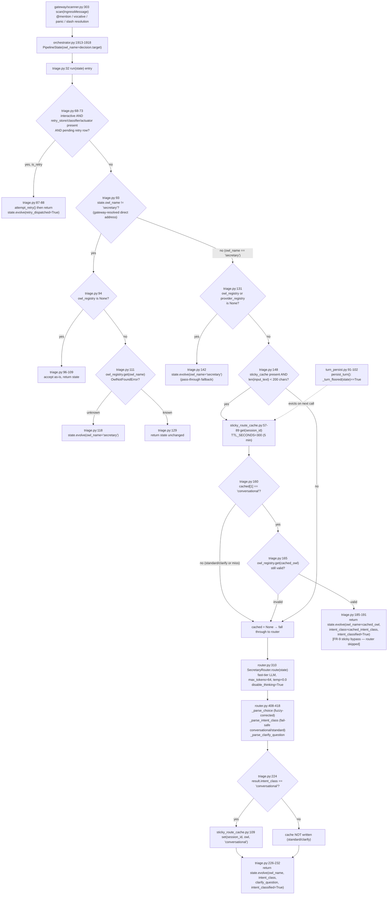
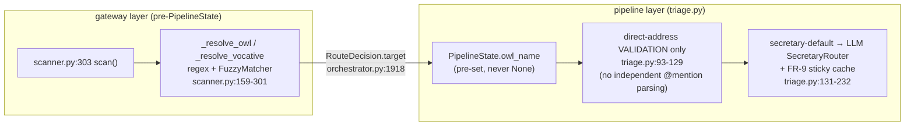

# Owl Routing / Triage (pipeline layer)

## Sources consulted

- `src/stackowl/pipeline/steps/triage.py:1-233` — full file
- `src/stackowl/owls/sticky_route_cache.py:1-126` — full file
- `src/stackowl/owls/router.py:1-445` — full file (`SecretaryRouter`, `FuzzyMatcher`)
- `src/stackowl/pipeline/turn_persist.py:75-204` — sticky-cache eviction on floor (lines 92-102)
- `src/stackowl/gateway/scanner.py:1-337`
- `src/stackowl/startup/orchestrator.py:1835-1928` — `_dispatch_turn`
- `src/stackowl/owls/registry.py:295,303`

## Concrete findings

**triage.py `run()` decision order:**
1. Task 7 retry-intent hook (lines 47-88), interactive-gated — can short-circuit before any routing.
2. Direct-address branch (`owl_name != "secretary"`, lines 93-129): validate via `owl_registry.get()`, demote to secretary on `OwlNotFoundError`.
3. Registries-missing fallback (131-142): force secretary.
4. FR-9 sticky-routing bypass (144-191): only when `len(input_text) < 200` chars. Reads `StickyRouteCache.get(session_id)` — **verified**: only reused if `cached[1] == "conversational"` (line 160); standard/clarify cached entries are discarded even if present. Re-validates the cached owl still exists.
5. `SecretaryRouter` LLM call (193-232): on a non-clarify `"conversational"` result, seeds the sticky cache — write side is symmetric with the read-side restriction.

**`SecretaryRouter.route()`**: prompt lists `name: role` pairs + raw user text, asks for owl name + intent class (+ clarify question if applicable). Calls the `"fast"` tier, `max_tokens=64, temperature=0.0, disable_thinking=True`. Owl-name parsing runs through `FuzzyMatcher` before falling back to secretary; intent-class parsing fails safe to `"conversational"` on empty reply, `"standard"` on a non-empty-but-unparseable reply (deliberate act-over-ask bias).

**StickyRouteCache**: `TTL_SECONDS = 300` (5 minutes, `sticky_route_cache.py:32`) — NOT "≤30 min" as triage.py's own module docstring and comments still say. The 2026-07-01 adversarial review shrank it to 5 min; the docstrings were never updated. Stale-comment finding, not a behavior bug. Only `(owl_name, intent_class="conversational")` triples are ever stored — enforced by convention at the call sites, not inside the class itself.

**Eviction on floor — confirmed wired**: `turn_persist.py:92-102`, inside `persist_turn`'s `if floored:` branch, unconditionally computed at line 91 — fires on every floored turn, not a subset. Matches commit b65058d1.

**BOUNDARY ANSWER**: at `startup/orchestrator.py:1913-1926`. `GatewayScanner.scan()` runs entirely BEFORE any `PipelineState` exists, on raw `IngressMessage` text. Its output (`RouteDecision.target`) is copied verbatim into `PipelineState.owl_name`. So `state.owl_name` always arrives at `triage.py` already set — never `None`. Triage's "direct-address" branch does NOT duplicate the gateway's `@mention`/vocative parsing — it's a pure downstream VALIDATOR of what the scanner already decided (a second, independent registry lookup as cheap defense against a stale decision), demoting to secretary only on `OwlNotFoundError`.

**Division of ownership**: `gateway/scanner.py` owns syntactic/structural addressing (explicit `@mention`/vocative parsing). `pipeline/triage.py` owns semantic routing (LLM intent classification + short-follow-up caching) for anything the scanner left as the secretary default, plus a thin validation re-check of whatever the scanner already resolved. Command routes (`owl_name="system"`) bypass triage entirely — they never call `backend.run()`.

**Third source of `owl_name`** (noted, not traced in depth): sub-agent sessions, parliament rounds, scheduled/objective-driven turns, and retry replays construct `PipelineState` directly with `owl_name` already set, bypassing the gateway scanner entirely but still flowing through triage's same direct-address/secretary-default logic.

## Mermaid

## Confidence note + known gaps

High confidence on all traced call paths. Gaps: did not exhaustively verify every other `PipelineState(...)` construction site (sessions_send, sessions_spawn, delegate_task, parliament, objectives/driver, scheduler/handlers/goal_execution, durable/recovery) — a third source of `owl_name` beyond gateway-set/unset, flagged but out of scope for this trace. The docstring/TTL discrepancy (30min vs actual 5min) is stale-comment only, not a behavior bug.
