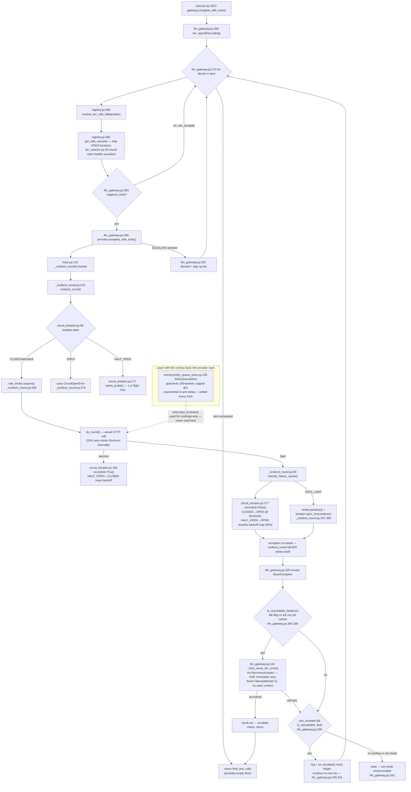

# Provider Abstraction + Escalation + Resilience

## Sources consulted

- `src/stackowl/providers/llm_gateway.py` (full, 389 lines)
- `src/stackowl/providers/circuit_breaker.py` (full, 337 lines)
- `src/stackowl/providers/_resilient_round.py` (full, 387 lines)
- `src/stackowl/providers/registry.py` (full, 827 lines)
- `src/stackowl/providers/tier_selector.py` (full, 67 lines)
- `src/stackowl/providers/base.py` (full, 410 lines)
- `src/stackowl/pipeline/recovery_actuator.py:1-80`
- `src/stackowl/memory/retry_queue_store.py` (grep sweep)
- `src/stackowl/pipeline/steps/execute.py:1895-1949`

## Concrete findings

**Tier cascade** (`LLMGateway.complete_with_tools`, `llm_gateway.py:228-362`): floor→ceiling walk over `LADDER=("fast","standard","powerful")`, sliced by `tier_span()`. Each tier resolves via `ProviderRegistry.resolve_tier_with_fallback`. A non-tool-capable tier is skipped upward when `can_escalate` (true except at the ceiling).

**`_retry_same_tier_once` vs cascade**: on a classified/cascadable fault, gated by a config flag and "not yet retried this tier," fires exactly ONE same-tier retry via `RecoveryActuator` BEFORE cascading. Falls through to cascade/re-raise if that also fails.

**CircuitBreaker**: 3 states CLOSED/OPEN/HALF_OPEN. Trips OPEN after `failure_threshold` (default 3) within `window_seconds` (default 60). Auto-promotes OPEN→HALF_OPEN after elapsed backoff. HALF_OPEN admits exactly 1 probe; success→CLOSED+reset backoff; failure→OPEN+**doubles** backoff (cap 900s). **State is per-provider (keyed by config name), NOT per-model** — all models under one provider share one breaker.

**`resilient_round()`**: does NOT retry itself — wraps exactly ONE remote round: breaker gate (no I/O) → rate-limiter acquire → execute once → classify outcome → record onto breaker (+ `limiter.penalize()`/`breaker.open_for()` on RATE_LIMIT) → **always re-raises**. Pure classification + bookkeeping around one attempt.

**Is the provider layer blind to upper layers? YES — architecturally isolated.** What crosses the `ProviderRegistry`/`LLMGateway` boundary: `user_text`, `system_text`, `tool_schemas`, `tool_dispatcher`, `floor`/`ceiling` labels, a static `purpose` string, `history`, `wrapup_deadline_fn`, `on_escalate`. None of this encodes "this is attempt N of an outer retry," an owl's failure history, or "this request already failed via a different mechanism":
- `_retry_same_tier_once` builds a brand-new `Failure(attempt=1)` every call — never receives an outer attempt counter.
- `RetryQueueStore` (app/goal-level, capped @3, exponential backoff) never passes its `attempt_count`/`banned_capabilities` down into the provider layer.
- `CircuitBreaker` is keyed purely by provider name — no trace_id/turn/owl/session concept.
- The ONLY thing crossing the boundary that survives is `trace_id`, used exclusively for cost accounting and log correlation — **never read by any retry/circuit-breaker decision.**

Every layer (SDK auto-retry, resilient_round's classify+record, CircuitBreaker's backoff, LLMGateway's same-tier-retry + cascade, RetryQueueStore's goal-level backoff) decides from its OWN local state only. No shared "attempt N across the whole stack" signal exists anywhere.

## Distinct retry/circuit-breaking mechanisms at THIS layer (excludes app-level RetryQueueStore)

1. SDK-level auto-retry (documented, not in-repo) — `base.py:363-367`
2. `resilient_round()`'s single-attempt breaker gate + classify + record — `_resilient_round.py:233-387`
3. CircuitBreaker HALF_OPEN adaptive backoff (doubles, cap 900s) — `circuit_breaker.py:277-297,319-331`
4. CircuitBreaker `open_for` quota-aware cooldown (parsed Retry-After) — `circuit_breaker.py:197-248`
5. `LLMGateway._retry_same_tier_once` — one immediate same-tier retry — `llm_gateway.py:119-139`
6. `LLMGateway` tier cascade (implicit "retry on a different provider") — `llm_gateway.py:156-224,269-362`
7. `ProviderRegistry.get_with_cascade`/`TierSelector` — round-robin among healthy providers WITHIN a tier, skipping OPEN breakers — `registry.py:485-652`
8. `RateLimiter.penalize()` — back-pressure penalty, separate from the breaker — `_resilient_round.py:337-345`

## Mermaid

## Confidence note + known gaps

High confidence — all core claims grounded in full-file reads of the five entry points plus registry/tier_selector/recovery_actuator. Did not fully read `rate_limiter.py` or `retry_queue_store.py` end-to-end (grep-sufficient to confirm architectural separation). Did not trace `openai_provider.py`/`anthropic_provider.py`'s internal ReAct-loop iteration structure in detail (covered by the execute-step sibling).
