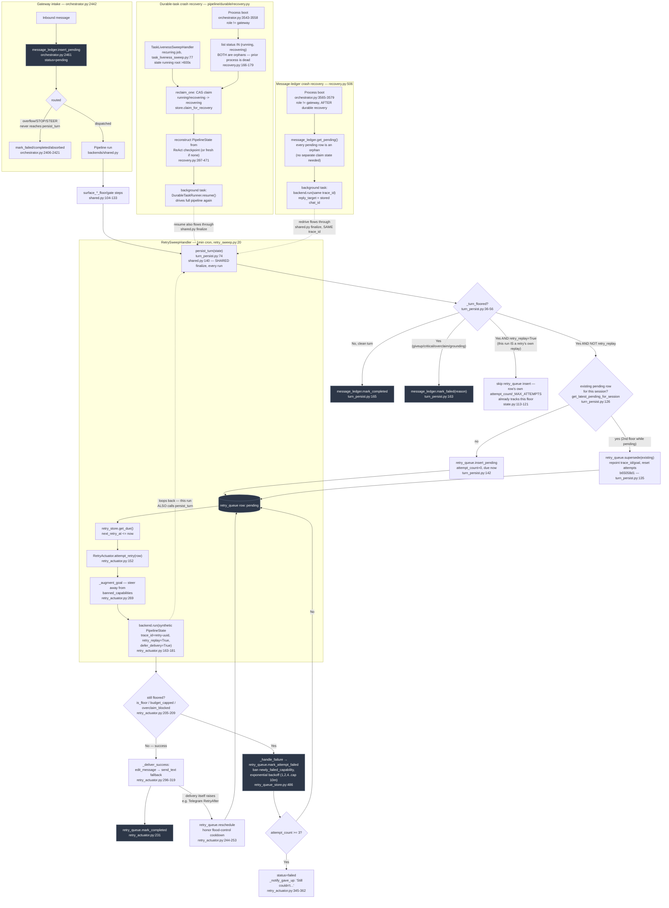

# Retry / Failure-Recovery — Application + Durable Layers

This is the most directly relevant feature to "no clear retries." Three genuinely separate mechanisms exist, converging only at one shared finalize call.

## Mermaid

## Verdict: three genuinely separate mechanisms, not accidental duplication — but converging on one shared finalize

1. **App-level delivery retry** (`retry_queue_store.py` + `RetryActuator` + `RetrySweepHandler`): a floored turn (past the honesty gates) gets ONE row per session, retried on a 1-minute sweep, exponential backoff, capped at 3 attempts, delivers via Telegram edit/send.
2. **Durable-task crash recovery** (`durable/recovery.py:94`): fires ONLY at process boot (plus a liveness sweep for stale `running` roots >600s) — recovers mid-flight ReAct checkpoints that were orphaned by a process crash, not by an honesty-gate floor.
3. **Message-ledger crash recovery** (`durable/recovery.py:506`): fires only at boot, redrives any `pending` message_ledger row under the SAME trace_id — a different orphan concept again (no durable-task identity).

**Why not merged:** `RetryActuator`'s replay uses a synthetic `trace_id` that never touches `message_ledger`. The two crash-recovery paths key off entirely different tables (`durable_tasks` has no `trace_id`; `message_ledger` has no durable-task identity) and only fire at boot. All three converge only at the single shared `persist_turn` finalize call (`backends/shared.py:140`) — that convergence is intentional (one place owns floor-detection and terminal bookkeeping), not the mechanisms being the same thing wearing different names.

## Confidence note + known gaps

High confidence — control flow and schema backed by direct reads, including the negative claim ("retry replay never touches message_ledger") verified via call-site comparison.

Flagged gaps:
- `retry_queue_store.py`'s own docstring documents KNOWN, UNFIXED cross-instance races (two sweep workers polling `get_due` concurrently; no `trace_id` uniqueness) tracked in `deferred-work.md` against migration 0082. Single-row races ARE closed via `DbPool.transaction`; the two-worker race is not.
- `retry_queue` rows are Telegram-only by convention (`channel="telegram"` default) — whether Slack/Discord/WhatsApp floors get a retry row at all, or silently mis-tag as telegram, was not verified.
- `delivery_gate.py`'s `_attempts_for_state`/`is_consequential_giveup_now`/`_critical_failure_classes` (the actual source of "what counts as floored") were not read in full — treat that file as load-bearing for this whole map.
- Test coverage for the `b65058d1` supersede-dedup path and sticky-cache eviction was not verified (implementation only).
