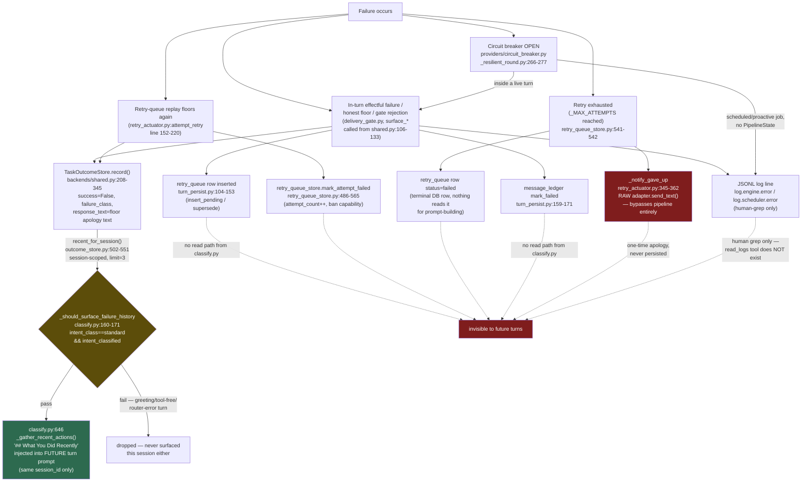
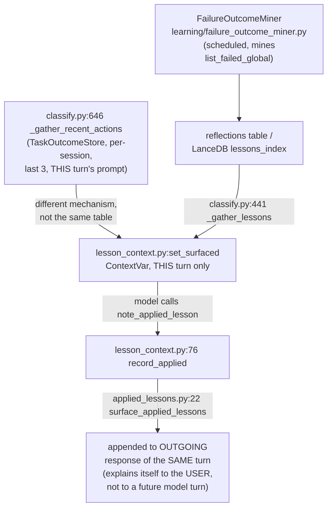

# Self-Observability — Does the Model See Its Own Failures?

This directly answers "provider basically blind what happening with agent, owl, tool, skill, learning and overall platform."

## Sources consulted

- `src/stackowl/pipeline/steps/classify.py:160-171,278-343,600-692`
- `src/stackowl/memory/outcome_store.py:89-165,502-551`
- `src/stackowl/pipeline/applied_lessons.py:1-57`
- `src/stackowl/pipeline/lesson_context.py:1-112`
- `src/stackowl/pipeline/backends/shared.py:96-345`
- `src/stackowl/pipeline/turn_persist.py:1-242`
- `src/stackowl/pipeline/retry_actuator.py:1-363`
- `src/stackowl/memory/retry_queue_store.py:48-146,486-565`
- `src/stackowl/providers/circuit_breaker.py`, `_resilient_round.py:200-300`

## Finding A — `read_logs` does not exist (CONFIRMED, independent re-verification)

```
$ grep -rn "read_logs" src/
(no output, exit code 1)
$ grep -rln "read_logs" . --include="*.py" --include="*.md"
CLAUDE.md
PATHFINDER-2026-07-22/00-features.md
```

Zero hits in any `.py` file anywhere in the repo. The only two files mentioning `read_logs` are CLAUDE.md itself (documents it as real, with example queries) and this pathfinder audit's own Phase-0 report. **The documentation is actively false.** A future Claude session reading CLAUDE.md will believe it has a `read_logs` tool, attempt to call it, and fail — or worse, assume logs are unqueryable and skip debugging a human could do in one `jq` command.

## Finding B — `_gather_recent_actions` (classify.py:278-343)

- Reads `TaskOutcomeStore.recent_for_session(session_id, limit=3, exclude_trace_id=trace_id)` — limit confirmed both at signature default and call site.
- SQL scope: `WHERE owner_id = ? AND session_id = ?` — **session-scoped, NOT owl-scoped**. Two different owls talked to in the SAME session_id share visibility; a DIFFERENT session_id (new chat/thread, anything the scheduler spins up) is completely invisible.
- Gated by `_should_surface_failure_history` (classify.py:160-171): only fires when `intent_class == "standard" and intent_classified` — a greeting, direct-address, or router-error turn never sees this block even if failures exist.
- Content per item: `✔/✘` glyph, `input_text[:100]`, `tools: <sequence>`, `[failure_class]` tag, `-> response_text[:120]`.

## Finding C — `surface_applied_lessons`/`lesson_context.py` is a DIFFERENT mechanism, easy to conflate with B

A per-turn ContextVar (bind/reset each turn) carrying lessons `_gather_lessons` surfaced from the learning pipeline's LanceDB index, plus the model's own `note_applied_lesson` self-reports. `surface_applied_lessons` renders those self-reports **appended to the OUTGOING response of the SAME turn** — it never feeds a future prompt. It answers "why did you do that" to the USER, not "what did I do" to the model on a later turn.

## Finding D — the "does it loop back" verdict, per failure type

1. **In-turn effectful failure / honest floor / gate rejection**: **YES, loops back**, via `_capture_outcome` (runs unconditionally after the gate cascade), which persists a `task_outcomes` row with `success=False`, a derived `failure_class`, and `response_text` = **the post-floor apology text itself**. This is exactly what `_gather_recent_actions` reads on a later turn, subject to Finding B's constraints. Note: `persist_turn` deliberately does NOT write floored assistant prose into `memory_bridge` (anti-laundering, LM-3) — only the short-term `task_outcomes` path sees it.
2. **Retry-queue replay**: re-runs the FULL pipeline (`retry_replay=True`), so it goes through `_capture_outcome` again — each retry attempt gets its own visible row (same session_id as the original).
3. **Retry exhaustion (3rd/final failure)**: **NO, does NOT loop back.** `_notify_gave_up` sends the "still couldn't" notice directly via `adapter.send_text()` — a RAW channel send that completely bypasses the pipeline. No `PipelineState`, no `_capture_outcome`, no `task_outcomes` row, no `persist_turn`. This is failure mode (c): a one-time apology to the user, then permanently forgotten by the system. The only durable trace is the `retry_queue` row's `status="failed"` column (nothing reads it for prompt-building) and whatever JSONL log lines fired.
4. **Provider circuit-breaker opens**: if inside a live turn, propagates into `state.errors` and gets swept into failure mode (1) — reaches `task_outcomes.failure_class`, potentially visible to a future same-session turn. If it opens for a scheduled/proactive job with no user-facing `PipelineState`, it never touches `task_outcomes` — that's mode (a)-only, a JSONL log line.

## Mermaid





## Confidence note + known gaps

High confidence on A, B, C, D.1-D.3. D.4 (circuit breaker) is medium confidence — confirmed the raise site and that it lands in `state.errors` for an in-turn call, but did not verify no provider call site silently catches-and-falls-back before the exception reaches `state.errors`. Did not verify how `session_id` persists/resets across a long-running Telegram conversation (whether the 3-item window is effectively a rolling forever-window or resets) — belongs with gateway/session-lifecycle ownership. The learning/mining pipeline's timing (scheduled/batched, not per-turn) materially affects how "fresh" a surfaced lesson can be — confirmed by the sibling learning-pipeline report.
