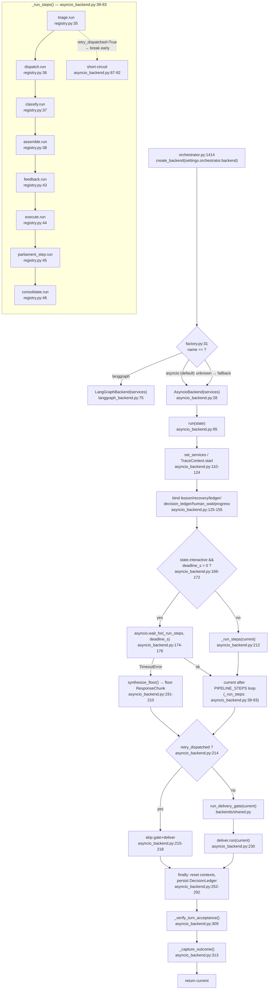
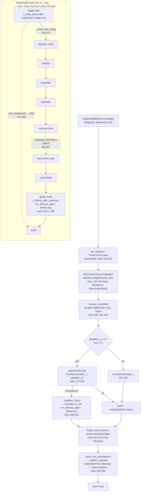

# Turn Pipeline Orchestration — AsyncioBackend vs LangGraphBackend

## Sources consulted

- `src/stackowl/pipeline/registry.py` (34 lines, full read) — `PIPELINE_STEPS`
- `src/stackowl/pipeline/backends/asyncio_backend.py` (315 lines, full read) — `AsyncioBackend`
- `src/stackowl/pipeline/backends/langgraph_backend.py` (500 lines, full read) — `LangGraphBackend`
- `src/stackowl/pipeline/backends/factory.py` (50 lines, full read) — `create_backend()`
- `src/stackowl/pipeline/backends/shared.py:1-60` — shared post-run seam docstring + imports
- `src/stackowl/config/settings.py:383-408` — `OrchestratorSettings`
- `src/stackowl/startup/orchestrator.py:1380-1429` — where `create_backend()` is actually invoked
- `pyproject.toml:18-24` — main (non-dev) dependency block
- `tests/pipeline/backends/test_factory.py` (full read, 54 lines)
- `tests/pipeline/backends/*.py` — file listing + line counts (asyncio: 4 files/443 lines; langgraph: 3 files/304 lines; shared: 117 lines)

## Concrete findings

**1. `PIPELINE_STEPS` (registry.py:34-47):** `triage → dispatch → classify → assemble → feedback → execute → parliament_step → consolidate`, then `deliver` runs after via `run_delivery_gate()` (applied_lessons → recovery → persistence_handoff → giveup_floor → overclaim_gate → grounding_gate → critical_failure → command_hint) → `deliver.run()`.

**2. `AsyncioBackend.run()` (asyncio_backend.py:95-314):** trace_id minted upstream, not here. Steps run via `_run_steps()` (39-93), each wrapped in a `TraceContext.span`, errors captured (never raised). Contextvars bound: TraceContext, lesson_context, recovery_context, tool_outcome_ledger, decision_ledger (default ON), human_wait_ctx, progress callback. Global interactive deadline via `settings.system.interactive_turn_timeout_s`, only enforced when `state.interactive`. Timeout → `synthesize_floor()`. Finally: reset contexts, persist DecisionLedger (best-effort), `_verify_turn_acceptance()` + `_capture_outcome()`.

**3. Is `LangGraphBackend` live? VERDICT: LIVE, config-gated opt-in, not dead code.**

- Selection: `startup/orchestrator.py:1414` — `create_backend(settings.orchestrator.backend, ...)`, runs on every real startup.
- Flag: `OrchestratorSettings.backend: Literal["langgraph","asyncio"]` (settings.py:388-396), default `"asyncio"`. Its own docstring calls langgraph "experimental/opt-in." No shipped `stackowl.yaml` sets it — a fresh deploy always runs `AsyncioBackend`.
- `langgraph>=1.2.1` / `langgraph-checkpoint-sqlite>=3.1.0` are in pyproject's **main** deps, not dev-only — the import path is always live.
- Real, sized test coverage: `test_factory.py`, per-concern parity pairs (`test_langgraph_backend_deadline.py` 141 lines vs `test_asyncio_backend_deadline.py` 112, `_durable_scope` 62 vs 47, `_retry_seam` 101 vs 110), plus a shared `test_shared_seam.py` (117 lines).
- Dedicated migration `db/migrations/0008_langgraph_checkpoints.sql` for its checkpoint persistence.
- **Not vestigial.** Fully implemented, tested, reachable via ordinary config — off by default. The real risk is **drift between two maintained backends**, not dead code.

**4. Same `PIPELINE_STEPS`, duplicated wrapper boilerplate:**

Both backends drive the exact same step functions from `registry.py` — the *business logic* is single-sourced, no drift risk there. What IS duplicated near-verbatim across the two `run()` methods (not shared via `shared.py`):
- Contextvar bind/reset sequence (~25 lines: `asyncio_backend.py:111-137` vs `langgraph_backend.py:117-143`)
- Deadline computation (~10 lines: `asyncio_backend.py:166-171` vs `langgraph_backend.py:152-157`)
- Deadline-floor construction (~25 lines: `asyncio_backend.py:191-210` vs `langgraph_backend.py:281-308` — LangGraph's version is forced to manually re-invoke `run_delivery_gate`+`deliver.run` because its graph's own "deliver" node dies with the cancelled task)
- Finally block: recovery-summary log, decision-ledger persist, contextvar resets (~35 lines: `asyncio_backend.py:252-292` vs `langgraph_backend.py:202-241`)
- Tail calls to `_verify_turn_acceptance`/`_capture_outcome` (implementation shared via `shared.py`, only the 4-line call site duplicated)

**Rough estimate: ~90-110 lines of near-duplicate run()-wrapper logic.** Both files self-document this as "parity" maintenance (e.g. `langgraph_backend.py:114` "Parity with AsyncioBackend (FR-13 gap fix)") — concrete evidence the two implementations have already drifted and required a manual re-sync at least once (FR-13, acceptance verification).

## Mermaid — AsyncioBackend

## Mermaid — LangGraphBackend

## Confidence note + gaps

High confidence — every claim backed by exact file:line from a full read of the four core files plus settings/factory/startup wiring and the test directory listing. Not verified: exact content diff of `langgraph_callbacks.py`'s `LoggingCallback` vs AsyncioBackend's `TraceContext.span` wrapper (functionally parallel, structurally different, not counted in the duplicate-line estimate). Not verified: whether any real deployed `stackowl.yaml` outside this repo sets `orchestrator.backend: langgraph` — the repo itself ships no such override, so `asyncio` governs a fresh checkout.
