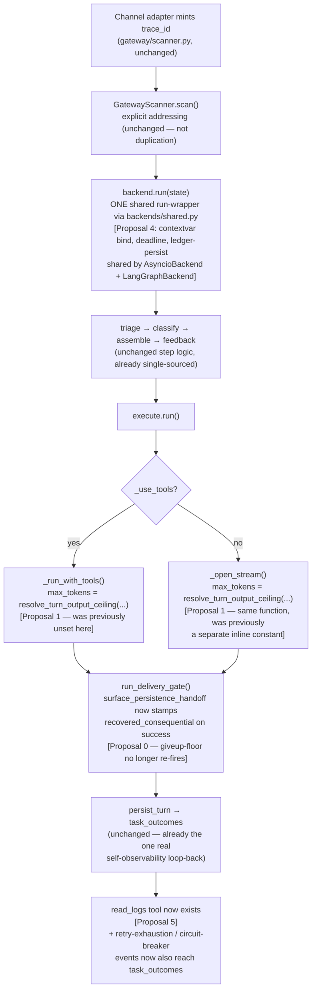

# Unified Proposal

Written by the orchestrator (not delegated), per pathfinder's Phase 3 rule. Each proposal targets a Phase-2 finding that survived scrutiny — the items resolved as "not duplication" (owl routing, loop guards, dual backends' step logic) are left alone; nothing here adds a new abstraction layer, a feature flag preserving both old and new paths, or a registry where a direct call suffices.

---

## Proposal 0 (do first, independent of everything else): fix the persistence-handoff bug

**Target:** `pipeline/delivery_gate.py:1475` `surface_persistence_handoff`, and `:329` `surface_consequential_giveup_floor`.

**Fix:** when the handoff delivers a real answer, stamp the evolved state so the very next gate doesn't re-derive a stale give-up verdict from ledger fields the handoff already resolved — e.g. `state.evolve(responses=(chunk,), consequential_failures=(), recovered_consequential=True)` instead of just `state.evolve(responses=(chunk,))`. `surface_consequential_giveup_floor`'s `decide_delivery(state)` already checks `recovered_consequential`-shaped signals elsewhere in the same file (per the flowchart trace) — this closes the gap with the SAME mechanism the codebase already uses, not a new one.

**Why first:** this is the platform's only non-mechanical "try to fix it before giving up" rung, verified dead in the normal production path, zero test coverage, small and well-understood. Shipping it doesn't require deciding anything about the bigger consolidation below.

---

## Proposal 1: One output-token ceiling authority, not four

**Target components today:** `config/provider.py:84` (250000), `providers/openai_provider.py`'s `_output_cap()`, `pipeline/steps/execute.py:145` `_CONVERSATIONAL_MAX_TOKENS` (tool-free only), `owls/manifest.py:73` `OwlAgentManifest.max_tokens` (independent, client-side-only).

**Simplest unification:** keep exactly the roles that already work, close the one real gap. `config/provider.py`'s 250000 stays the outer physical backstop (rename its usage site comments to say so explicitly, mirroring how `tool_max_iterations` already documents its derivation from `DEFAULT_TURN_MAX_STEPS`). Introduce ONE function — call it `resolve_turn_output_ceiling(intent_class, uses_tools) -> int | None` — that both the tool-loop call site (`_call_default` in `execute.py`, which already gained an unused `max_tokens` plumbing point today) and the plain-stream call site (`_open_stream`) call, instead of the plain-stream path having its own override and the tool-loop path having none at all. `OwlAgentManifest.max_tokens` stops being an independently-tuned number — it becomes a pure backstop set well above whatever `resolve_turn_output_ceiling` would ever return, so it only ever fires on genuine runaway, never as a second shaping decision.

**What each old call site becomes:**
- `execute.py`'s tool-loop branch (`_call_default`'s `_extra` dict): add `_extra["max_tokens"] = resolve_turn_output_ceiling(...)` — today this path passes nothing and silently inherits `_output_cap()`'s full window-derived value even for a trivial tool-using turn.
- `execute.py`'s plain-stream branch: replace the inline `_CONVERSATIONAL_MAX_TOKENS if ... else None` with a call to the same shared function.
- `owls/manifest.py`'s per-owl `max_tokens`: raise to a value that's a pure backstop (e.g. 3-5x the largest real `resolve_turn_output_ceiling` output), or remove the field and have `OwlResourceGuard` read the same resolved ceiling directly — avoid a second independently-configured number for the same concept.

**Loss of capability:** none — this closes a gap (tool-using conversational-adjacent turns were never capped at all), it doesn't remove capability from anything that currently works.

---

## Proposal 2: One wall-clock timeout authority, not five

**Target:** `authz/bounds.py:50` `DEFAULT_TURN_MAX_TIME_S=120.0`, `owls/manifest.py:79` `timeout_seconds=400.0`, `providers/*_provider.py`'s `_ROUND_DEADLINE_FALLBACK_S=120.0`, `config/provider.py:71` `timeout_seconds=30.0` (dead).

**Simplest unification:** apply the SAME derivation pattern the codebase already uses correctly for `tool_max_iterations` — pick the layer that should be authoritative (the per-stream-item timeout, since it's the one that's been live-incident-tuned twice) and derive the others from it, or vice versa, so the outer can never be tighter than the inner. Concretely: `DEFAULT_TURN_MAX_TIME_S` should be defined as `>= OwlAgentManifest.timeout_seconds` by construction (e.g. a small constant multiple, since a turn may legitimately need more than one stream item's worth of time), not as an independently-chosen 120. Delete `config/provider.py:71`'s dead `timeout_seconds` field entirely (it's read nowhere) rather than leave a landmine a future operator might set and have it silently do nothing — per the "prefer deletion over abstraction" rule.

**Loss of capability:** none — the dead field's removal costs nothing since nothing reads it; if a real per-HTTP-call timeout is wanted, that's a new feature, not a restoration.

---

## Proposal 3: Merge the duplicated positive-only-learning filter, keep the two pipelines' distinct outputs

**Target:** `owls/dna_attribution.py`'s `_filter_scored_outcomes` vs `learning/tool_outcome_miner.py`'s equivalent filter — two independent re-implementations of "never learn from a failed outcome."

**Simplest unification:** one shared helper, e.g. `TaskOutcomeStore.iter_positive_signal(scope: "owl" | "global", since_epoch)`, used by both `DnaAttributor.attribute()` and `ToolOutcomeMiner.mine()`. This is the ONLY part that's actually identical — the two pipelines' *outputs* (DNA trait deltas vs. tool heuristics/lessons) are genuinely different and stay exactly as they are, delivered through their existing two separate prompt-injection seams. Do not attempt to merge DNA mutation and lesson-mining into one pipeline — per pathfinder's own rule, that would be unifying legitimately specialized components wearing a similar shape.

**Loss of capability:** none.

---

## Proposal 4: Extract the ~100 lines of duplicated backend run()-wrapper boilerplate

**Target:** `pipeline/backends/asyncio_backend.py`'s `run()` vs `pipeline/backends/langgraph_backend.py`'s `run()` — near-identical contextvar bind/reset, deadline computation, decision-ledger persistence, and deadline-floor construction, hand-copied between the two files and already proven to drift once (the documented FR-13 gap fix).

**Simplest unification:** move the shared blocks into `backends/shared.py` (which already owns `run_delivery_gate`, the natural home) as functions both backends call: e.g. `bind_turn_contexts(state) -> ContextManager`, `compute_interactive_deadline(state) -> float | None`, `persist_decision_ledger(state)`. `LangGraphBackend`'s one genuinely-different piece — manually re-invoking `run_delivery_gate`+`deliver.run` on a deadline because its graph's own "deliver" node dies with the cancelled task — stays as its own small deadline-floor callback, since that difference is forced by the two engines' different cancellation semantics, not copy-paste laziness.

**What each old call site becomes:** both `run()` methods shrink to: bind via the shared helper, run their own step-driving mechanism (loop vs. graph — the one legitimately different part), call the shared deadline/ledger helpers, return. The ~90-110 duplicated lines become one definition each, called twice.

**Loss of capability:** none — this doesn't touch `PIPELINE_STEPS`, which is already correctly single-sourced.

---

## Proposal 5: build the self-observability capability CLAUDE.md already claims exists

**Target:** the `read_logs` tool, documented in CLAUDE.md with example queries, absent from the codebase.

**Simplest fix — two parts, not one:**
1. Either build `read_logs` as a real tool (query the JSONL log by trace_id / time range / level / tool name — the exact examples CLAUDE.md already gives) so the model has genuine on-demand access to its own recent behavior instead of nothing, **or** remove the false documentation from CLAUDE.md if the capability is deliberately out of scope. Leaving it documented-but-absent is strictly worse than either choice — a future session will act on it and fail.
2. Independently: `classify.py`'s `_gather_recent_actions` (the ONE mechanism that does loop back into the model's context) is session-scoped only and silently misses two failure modes entirely — retry exhaustion (`_notify_gave_up` bypasses the pipeline via raw `send_text`) and a circuit breaker opening for a scheduled/proactive job. Recommend widening `_capture_outcome`'s call sites to cover both, so "the platform gave up on this permanently" and "a provider is currently unreachable" are at least as visible to the model as an ordinary in-turn floor already is.

**Loss of capability:** none. This is additive.

**Note — not proposed here:** raising `HARD_TOOL_COUNT_CAP`, `LEAN_WINDOW_THRESHOLD`, `MAX_DELEGATION_DEPTH`/`MAX_CONCURRENT_DELEGATIONS`, sticky-route `TTL_SECONDS`, or `MAX_SCHEDULED_OWLS` (the census's other flagged tuning levers). These are real behavior-shaping policy choices, not duplication or a bug — they belong to you as product decisions (how wide should delegation fan-out be, how long should routing stay sticky), not something an architecture audit should silently resolve. Flagged in the census for your review, not bundled into a code-change proposal here.

---

## Open design question — NOT proposed as a fix, needs your call

**Provider-layer resilience is completely isolated from the app-level `RetryQueueStore`** (Duplication Report #8) — 8 distinct retry/circuit-breaking mechanisms at the provider layer, the app-level retry queue, and no shared "attempt N across the whole stack" signal anywhere. This is not obviously a bug: defense-in-depth across independent layers is a legitimate design. But it does mean a request can in principle be retried by several layers simultaneously with none aware of the others' attempt counts. Two honest options, not a recommendation:
- **Leave it isolated** (current state) — simpler, each layer's contract stays self-contained, but a retried request gets no cheaper/faster on a 2nd attempt even though upstream already knows this exact goal just failed.
- **Thread a lightweight attempt-context hint** (e.g. "this is retry_queue attempt 2/3, capability X already failed") into the provider-call kwargs, purely advisory — a provider MAY use it to skip its own same-tier retry, but doesn't have to. This is a real new plumbing decision, not a mechanical dedup, so it's called out here rather than folded into a proposal.

---

## Combined flowchart — the corrected turn lifecycle after proposals 0, 1, 2, 4

