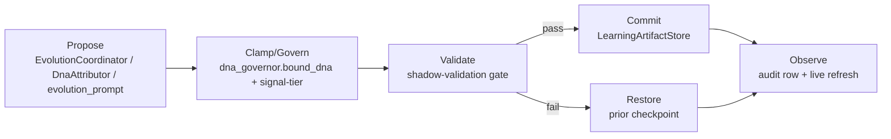

# Architecture Spine — Owl DNA Self-Improvement Lifecycle

## Design Paradigm

**Governed Pipes-and-Filters**: every mutation to a learned artifact (a DNA trait delta, a skill change) flows through five fixed stages — **propose** (compute a candidate delta) → **clamp/govern** (apply the hard ceiling) → **validate** (prove it doesn't regress) → **commit** (versioned write) → **observe** (audit log, live refresh). This formalizes what `evolution.py` already does implicitly for the nightly batch (checkpoint → persist → live-refresh → audit) and extends it with an explicit validate stage that doesn't exist today. Every new entry point (the per-task trigger, the tiered clamp, the shared versioning primitive) is a filter inserted into this one pipeline — never a parallel path.



## Invariants & Rules

### AD-1 — One pipeline, no side doors

- **Binds:** all features (FR-1–FR-17)
- **Prevents:** a caller writing directly to `owl_dna` / skill storage, bypassing clamp/validate/commit.
- **Rule:** every mutation to a learned artifact (DNA trait or skill) enters at Propose and only reaches storage via Commit. No tool, handler, or command may call a storage write method directly.

### AD-2 — Single versioning primitive

- **Binds:** Feature 1 (FR-1–FR-3)
- **Prevents:** a third independent snapshot/restore implementation appearing later (DNA and skills already built this twice — see PRD Background).
- **Rule:** `LearningArtifactStore` (new) is the only snapshot/hash-diff/restore/audit primitive. `DNACheckpointer` and `record_skill_mutation`'s internal storage logic are superseded by it, not duplicated — both DNA and skill call sites migrate to call `LearningArtifactStore` directly.

### AD-3 — Validate gates every promotion

- **Binds:** Feature 4 (FR-8–FR-11), Feature 5 (FR-12–FR-14)
- **Prevents:** `evolve_now` (or any future trigger) shipping a "fast path" that skips shadow-validation "just this once."
- **Rule:** the shadow-validation gate is the only code path allowed to move a checkpoint's proposed deltas into live storage. The nightly batch and `evolve_now` both call the same gate function — there is exactly one promotion function in the codebase, not one per caller. The gate's N-consecutive-non-regression threshold and held-out sample size are a single shared config, not parameterizable per-caller — a caller satisfying this AD's wording with a looser threshold for itself would violate its intent. [Added post-elicitation, epics-and-stories phase: closes a literal-compliance-but-intent-violation gap found via Inversion Analysis + Red Team pressure-test.]

### AD-4 — Tiering narrows, never widens

- **Binds:** Feature 3 (FR-6–FR-7)
- **Prevents:** a future "high-confidence signal" argument being used to widen `bound_dna()`'s ceiling instead of narrowing the delta beneath it.
- **Rule:** signal-strength tiering computes an *effective delta* strictly ≤ the raw proposed delta, before that effective delta is passed into `bound_dna()`. `bound_dna()`'s own clamp constants (`MAX_DELTA`, `ENVELOPE`, `FLOOR_TRAITS`) are never parameterized by signal strength — they stay the final, unconditional ceiling.

### AD-5 — evolve_now never touches the statistical path

- **Binds:** Feature 5 (FR-13)
- **Prevents:** a later "optimization" wiring `evolve_now` to opportunistically check `DnaAttributor` when enough samples happen to exist, silently reintroducing what the sample floor exists to prevent.
- **Rule:** `evolve_now`'s call into `EvolutionCoordinator._evolve_one` is parameterized to force the LLM-fallback path (`evolution_prompt.py`) unconditionally — never branches on `DnaAttributor`'s sample count.

### AD-6 — `decay_rate_per_week` is implemented, not deleted [ASSUMPTION]

- **Binds:** Feature 6 (FR-15)
- **Prevents:** the field staying defined-but-inert, silently misrepresenting the system to the next reader.
- **Rule:** a scheduled or on-read decay function moves an unreinforced trait back toward its authored baseline at `decay_rate_per_week`, itself passing through Clamp (AD-1) like any other mutation. `[ASSUMPTION: chosen over deletion because it's a real stability mechanism and the smaller, safer change of the two — not re-confirmed with the user at architecture level; flag for review before Feature 6's story starts.]`

### AD-7 — Cross-signal is advisory-only, both directions

- **Binds:** Feature 7 (FR-16–FR-17)
- **Prevents:** skill success-rate silently becoming a gating condition on DNA mutation, or DNA traits silently gating skill retention — either would weaken an existing, deliberate rule (positive-only learning; skill security-scan gate).
- **Rule:** both cross-signal inputs are additive weights consumed by the existing decision function, never a new veto/gate of their own. Exact consumption mechanism is deferred (see Deferred) — this AD fixes only the boundary.

## Consistency Conventions

| Concern | Convention |
| --- | --- |
| Naming | New module `owls/learning_artifact_store.py`; new tool `tools/knowledge/evolve_now.py` (mirrors `reflect_now.py` naming); new gate module `owls/shadow_validator.py`. |
| Data & formats | Snapshot rows: `(artifact_type: "dna"\|"skill", artifact_id, payload_json, reason, created_at ISO8601)` — one schema for both artifact types, per AD-2. |
| State & mutation | All writes go through `DbPool.transaction()` (existing convention, mirrors `mark_attempt_failed`'s read-compute-write pattern from tonight's retry-queue fix). |
| Logging | 4-point logging (entry/decision/step/exit) on every new `execute()`-shaped method, per NFR-3 — `log.owls` namespace for DNA-side, existing `log.skills`/`log.tool` namespaces unchanged for skill-side call sites. |
| Errors | Never catch-and-hide; a validate-stage failure logs at WARNING with the specific non-regression that failed, a commit-stage failure logs at ERROR and triggers AD-3's restore path. |
| Signal strength (AD-4) | One shared enum, `SignalStrength = VERIFIED \| OUTCOME_BINARY \| LLM_QUALITY`, defined once in `dna_governor.py` and imported by every propose-stage caller — not re-derived per caller. |

## Stack

No new dependencies (PRD Constraint). Reuses the existing pinned stack: Python ≥3.13, pydantic (frozen models, matches `OwlDNA`'s existing shape), `aiosqlite` via `DbPool`, existing migration tooling (`db/migrations/*.sql`, sequential numbering after `0012_dna_checkpoints.sql`).

## Structural Seed

```text
src/stackowl/owls/
  learning_artifact_store.py   # NEW — AD-2: unified snapshot/restore/audit (supersedes DNACheckpointer + skill_manage's record_skill_mutation internals)
  shadow_validator.py          # NEW — AD-3: replay harness, N-consecutive-non-regression gate (Feature 4, largest new-logic surface per PRD sizing note)
  dna_governor.py              # MODIFIED — AD-4: signal-strength tiering ahead of bound_dna()'s existing clamp
  evolution.py                 # MODIFIED — AD-1/AD-3: EvolutionCoordinator calls shadow_validator before commit; AD-6 decay hook
  dna.py                       # MODIFIED — Feature 6: decay_rate_per_week gains a real consumer
  dna_attribution.py           # MODIFIED — Feature 7: optional skill-success-rate input signal (advisory, AD-7)
src/stackowl/tools/knowledge/
  evolve_now.py                 # NEW — AD-5: mirrors reflect_now.py's thin-wrapper shape
src/stackowl/skills/
  synthesizer_handler.py        # MODIFIED — Feature 7: exposes success_rate as an advisory DNA-attribution input; migrates its own storage calls to LearningArtifactStore per AD-2
src/stackowl/commands/
  owls_command.py                # MODIFIED — Feature 1: new dna-restore command, calls LearningArtifactStore.restore(checkpoint_id)
src/stackowl/db/migrations/
  00XX_learning_artifact_store.sql   # NEW — unified snapshot table (AD-2)
```

## Capability → Architecture Map

| Feature | Lives in | Governed by |
| --- | --- | --- |
| 1 — Unified versioning & rollback | `learning_artifact_store.py`, `owls_command.py` | AD-1, AD-2 |
| 2 — reflect_now reliability | `memory/reflection_writer_handler.py` (existing, verified not rebuilt) | AD-1 (n/a — read-path, no mutation) |
| 3 — Tiered mutation clamp | `dna_governor.py` | AD-4 |
| 4 — Shadow-validation gate | `shadow_validator.py`, `evolution.py` | AD-1, AD-3 |
| 5 — evolve_now trigger | `tools/knowledge/evolve_now.py` | AD-3, AD-5 |
| 6 — decay_rate_per_week | `dna.py`, `evolution.py` | AD-1, AD-6 |
| 7 — Skills↔DNA cross-signal | `dna_attribution.py`, `skills/synthesizer_handler.py` | AD-2, AD-7 |

## Deferred

- **Feature 7's exact consumption mechanism** — whether skill success-rate becomes a new attribution band dimension or a simple weighting multiplier is left to story-time design (PRD reviewer finding, low severity, Feature 7 is the first-cut candidate if scope tightens).
- **`shadow_validator.py`'s held-out sample selection strategy** (how many interactions, how "recent," how "held-out" is enforced against replay contamination) — the largest single design surface in this spine, deliberately left to Feature 4's own story rather than fixed here, since it's genuinely novel (no prior art in this codebase or, per PRD research, in the literature) and benefits from being worked with real interaction data in hand.
- **Cross-repo/cross-owl unified confidence scoring** — explicitly out of scope per PRD, not this spine's concern.
- **Migration numbering** — exact next migration number resolved at implementation time (sequential, avoids merge collisions with unrelated in-flight work).
