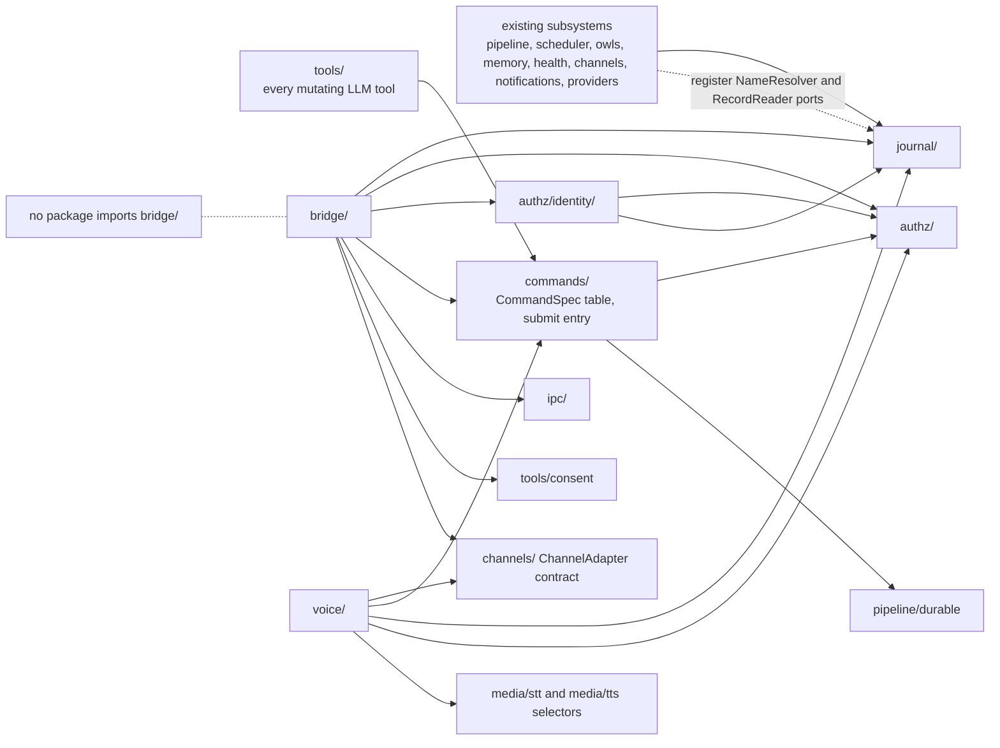
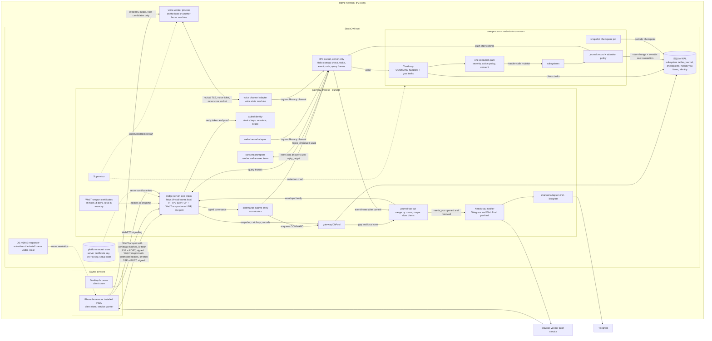
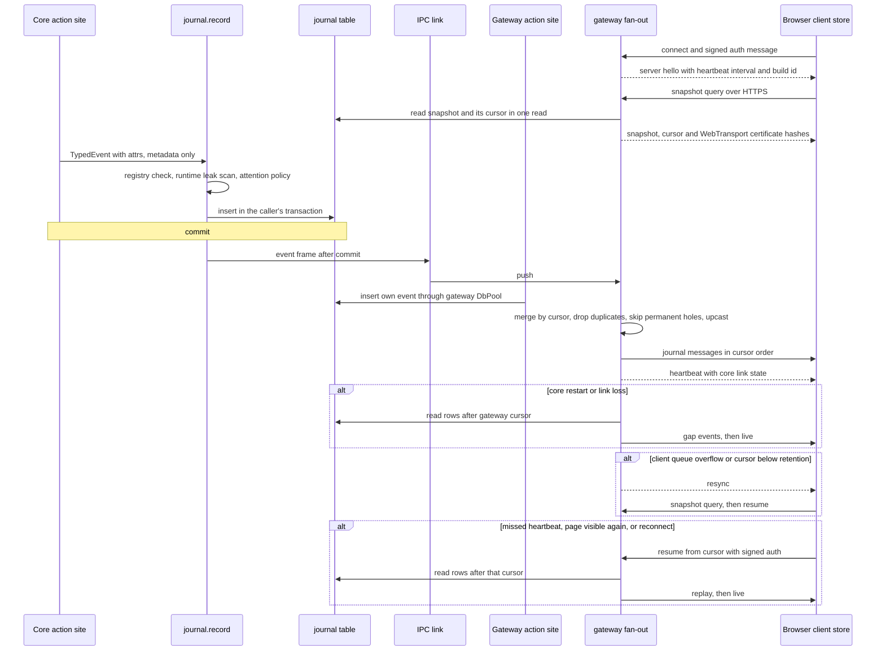

# Architecture Spine — StackOwl Bridge

## Design Paradigm

**CQRS around the one task loop, with an append-only event journal as the read model.** The write lane: every state-changing action is one `CommandSpec` declared in `commands/`. The Bridge, voice, slash commands and LLM tools all submit it through one typed entry, which enqueues a COMMAND task and wakes core by IPC frame. Core runs one execution path: severity, the action-policy gate, consent, then a deterministic handler that calls the subsystem mutator. The subsystems stay the authoritative source of truth. The read lane is a complete, metadata-only journal. Each event is recorded in the same transaction as its change, pushed core → gateway after commit, merged with the gateway's own events by cursor, and streamed to one client store per browser over WebTransport, with a `fetch`-streamed SSE fallback, all on one local-name origin on the home network. A browser starts from one snapshot and its cursor, then resumes by cursor.

| Layer | Responsibility | Packages |
| --- | --- | --- |
| Command lane | Command declarations, submit entry, wake frame, severity, action policy, consent, deterministic handlers | `commands/` (`CommandSpec` table, submit entry), `authz/` (severities, action policy, attendance, standing authority), `tools/consent` (prompters render and answer), `pipeline/durable` (`DurableTaskStore`, `TaskLoop`, COMMAND handler registry) |
| Identity | Setup-code consumer, owner principal, passkeys, device key registry, sessions, recovery code, attempt brake, push subscriptions | `authz/identity/` |
| Execution and truth | Carry out tasks; own authoritative state in SQLite or md | existing subsystems: `pipeline`, `scheduler`, `owls`, `memory`, `skills`, `tools`, `health`, `channels`, `notifications`, `providers`, `tenancy` |
| Read model | Event registry and upcasters, atomic recorder, append-only store, attention policy, Needs-you items and resolver, record readers, narrator, snapshot checkpoints, retention | `journal/` |
| Link | Event push, wake frame, typed query frames, Hello compatibility check between core and gateway | `ipc/` |
| Delivery | Gateway web server on the local-name origin, carriers and envelope family, fan-out, notifier, `web` channel adapter, snapshot, static assets | `bridge/` |
| Presentation | Client store, Svelte stations, Three.js Viewscreen, service worker | `web/bridge/` (source) → `bridge/static/` (committed build) |
| Voice channel | Gateway voice adapter, voice state machine, supervised speech worker | `voice/` on the `channels` contract |

## Invariants & Rules

Tags: `[ADOPTED]` is settled by the owner or by existing reality; `[ARCHITECT]` is the architect's call within adopted decisions, ratified at the reviewer gate. A retired AD keeps its id as a one-line tombstone.

Dependency direction (AD-7):

### AD-1 — Every state change is one declared command, submitted by every surface and tool, executed in the core loop [ADOPTED]

- **Binds:** every Bridge, voice, Telegram, TUI and slash-command action; every mutating LLM tool (`tools/scheduling/cronjob.py`, `tools/meta/owl_build.py` and the like); `commands/`; `pipeline/durable`; §8 item 2.
- **Prevents:** a back door; a second engine; a tool or slash command calling a mutator beside the command path; severity, consent or undo differing by surface; mutators instantiated in the gateway; a Bridge button waiting on the loop tick.
- **Rule:**
  - Each state-changing action has exactly one `CommandSpec` in `commands/spec/`: type, typed payload, severity (READ, WRITE, CONSEQUENTIAL from `authz/`), reversibility and undo type (AD-26).
  - The Bridge API, voice, the slash parser and LLM tools all call the one typed submit entry in `commands/spec/`. No surface and no tool calls a subsystem mutator directly: `cronjob.py`, `owl_build.py` and every other mutating tool migrate to submitting commands. A tripwire fails any call to a declared mutator from outside the COMMAND handler registry.
  - The submit entry needs only the spec table and the task store, so it runs in either process without subsystem services. It validates the payload, sets the requester kind from authenticated ingress provenance (never from the payload), and enqueues a COMMAND task carrying its `command_id` idempotency key and nonce. Gateway dispatch holds no mutators; a tripwire fails any subsystem mutator instantiated in the gateway.
  - A gateway enqueue sends a payload-free `tasks_enqueued` IPC frame that wakes core's `TaskLoop`. The tick stays a safety net only.
  - A command executes only in the core loop, through one path: severity check through the principal → action-policy gate (AD-27) → consent (AD-18) → deterministic handler. No dry-run or preview branch returns before the severity check. There is no generic "run any command" endpoint.

### AD-2 — The journal is a complete, derived, append-only SQLite table [ADOPTED]

- **Binds:** all subsystems, the Bridge read model, flight recorder, briefing, time axis, split-mode TUI progress (§8 items 1, 9).
- **Prevents:** a rewrite into true event sourcing, two authoritative copies of one fact, Bridge visuals built from snapshots alone, coupling to `audit_log` or jsonl, a second progress channel beside the journal.
- **Rule:** Every state change and action in every subsystem produces a typed event in one append-only SQLite table created by migration: tasks, jobs, owls, memory, consent, heals, deliveries, providers, health, channels, tool calls, model calls and delegation hops. The cursor is `INTEGER PRIMARY KEY AUTOINCREMENT`. Rows are never updated; only the AD-6 prune deletes them. Subsystem tables remain the source of truth, and nothing derives or decides subsystem state from the journal. The journal is neither `audit_log` nor the jsonl log, and neither feeds it. The in-process EventBus stays in-process pub/sub and is not a journal source. Split-mode TUI progress reads the journal stream.

### AD-3 — One recording API, one versioned event registry, additive evolution [ADOPTED]

- **Binds:** every emitter, every subsystem mutator, `journal/`, every journal consumer.
- **Prevents:** silent coverage gaps; stringly-typed event drift; one action recorded twice or not at all; one type meaning two things in two processes; history that the current code cannot read.
- **Rule:**
  - Subsystems call `journal.record(TypedEvent)` at the action site. For a command, the subsystem mutator is the only recorder of the domain event and takes a `CommandContext` (actor, `device_id`, requester kind, `trace_id`, command task id); the COMMAND handler records only `command.*` lifecycle events.
  - Every event type is declared once in the registry in `journal/` with its typed metadata-only `attrs` model, its one emitting process, its record kind (AD-4), its attention class (AD-5) and, for types that open Needs-you items, its resolving types. A type emitted from both processes is illegal. Actor and target kinds come from one closed list that includes `device`, `voice_worker` and `autonomous`. `record` accepts only registered types with valid `attrs`.
  - Evolution is additive-only: a new `schema_version` may only add optional fields, and a registered upcaster fills them for older rows on read, so every consumer (narrator, attention, fan-out, snapshot, browser) sees only the latest version. Removing or retyping a field means a new event type. Each version's model and upcaster stay until its last row is pruned; a tripwire checks this against `MIN(cursor)` per version.
  - Coverage tripwire: every migration-created table is listed in the registry with its event types, or marked `unjournaled` with a reason, and the tripwire diffs the migrated table set against the registry.
  - The registry digest (types, versions and attention policy version) is part of the IPC Hello (AD-33).

### AD-4 — Events carry metadata only; every openable target has a registered reader [ADOPTED]

- **Binds:** the event schema, every emitter, both carriers, record readers, subsystem prune windows, epics that add targets.
- **Prevents:** private content or secrets persisted in telemetry; a record that cannot be opened; `bridge/` reading raw tables; md content mirrored into tables.
- **Rule:**
  - An event carries type, actor, target, outcome, timings, ids, attention, `record_ref` and typed `attrs`. It never carries message text, memory content, prompts, secrets, display names or exception text; failures carry error codes. Actor and target ids are opaque, never session keys or native chat ids. `attrs` hold ids, numbers, closed enums and bounded labels of at most 64 characters.
  - The leak guard runs at runtime: `journal.record` scans every string value through the log redactor and a secret-pattern detector (key formats, high entropy), redacts matches and records that it redacted. A test drives canary secrets through real emitters.
  - `record_ref` is `{kind, locator}`: `sqlite` (table and row id), `md` (a `StackowlHome`-relative file and section anchor) or `graph` (node id). Each record kind has one registered reader supplied by the owning subsystem, typed and authority-checked. SQLite and md readers run in the gateway, md read-only; graph readers go through a typed core query frame and show unavailable while core restarts. `bridge/` never reads a table generically.
  - Owning rows referenced by `record_ref` are kept at least as long as journal retention; a tripwire fails any referenced record kind whose prune window is shorter. A target that is gone anyway opens as an `expired` record, never an error.
  - A target with no owning store gains a table by migration (incidents, finished-task history, per-turn decisions). md- and graph-backed targets never gain mirror tables.

### AD-5 — One attention policy classifies every event; only give-up events need the owner [ADOPTED]

- **Binds:** `journal/`, `bridge/`, the notifier, the front end, Needs-you items, proactive speech.
- **Prevents:** the accent colour drifting between subsystems; a second copy of the rules in the browser; every self-healed failure paging the owner.
- **Rule:** One attention policy in `journal/` classifies every event from its registered class as `ambient`, or `needs_you` with intensity `normal` or `high`. Failure and heal-in-progress events are `ambient`. Only explicit give-up or unhealed event types (such as `heal.exhausted`, `task.dead_lettered`, `job.parked`), recorded by the owner of the retry or heal loop when it stops trying, are `needs_you` at `high` (Q34); "unhealed" is a recorded event, never the absence of one. A `needs_you` event opens a Needs-you item (AD-28). Classification is pure, with no I/O on the write path. Emitters and the browser never classify. The Needs-you strip, the accent colour, both sound classes, the briefing, phone notifications and proactive speech (only while a client store is visible, mutable there) all read that classification. There is no `fault` class.

### AD-6 — Journal retention is a setting, pruned by one seeded job [ADOPTED]

- **Binds:** the journal table, snapshot checkpoints, the prune job, the idempotent job seeder.
- **Prevents:** unbounded growth on small hardware; silent loss of flight-recorder history; orphaned rows from retired writers; a prune holding the write lock; pruned secrets lingering on disk.
- **Rule:** Retention is a setting with a 30-day default. One scheduled prune job, seeded by the idempotent job seeder, prunes the journal; nothing prunes it ad hoc. It deletes in bounded batches with `secure_delete` on and checkpoints the WAL afterwards. It never deletes an event referenced by an unresolved Needs-you item, and keeps the newest snapshot checkpoint at or before the oldest retained cursor (AD-35). Retiring an event writer deletes its code, its registry type and its rows in the same change. The default stays provisional until spike B2.

### AD-7 — Package boundaries, dependency direction and relocation before deletion [ADOPTED]

- **Binds:** `src/stackowl/journal/`, `src/stackowl/commands/spec/`, `src/stackowl/authz/`, `src/stackowl/authz/identity/`, `src/stackowl/bridge/`, `src/stackowl/voice/`, `control_plane/`, `config/`.
- **Prevents:** subsystems importing from the Bridge; `journal/` importing subsystems for names; surfaces importing `bridge/` for authority or copying it; the setup code or brute-force brake lost with control_plane; the old dashboard's guards leaking into the new server; dead code left behind.
- **Rule:**
  - `journal/` holds the event registry and upcasters, recorder, store, attention policy, Needs-you items and resolver, record-reader registry, narrator, snapshot checkpoints and retention. Every subsystem may import it. It imports nothing from `bridge/`, `voice/` or any subsystem; names and records reach it through registered ports.
  - `commands/spec/` holds the `CommandSpec` table and the one submit entry. It depends on `authz/` and `pipeline/durable` only, enforced by a tripwire. The rest of `commands/` is the existing slash-command surface, which submits through that entry (owner placement vote, 2026-09-13).
  - `authz/` holds the READ, WRITE and CONSEQUENTIAL severities, the principal `may` check, the action-policy gate, attendance and standing authority (AD-27). Every surface asks `authz/`.
  - `authz/identity/` holds owner identity, enrolment and device keys (AD-17, AD-37).
  - `bridge/` holds the gateway-hosted web server, the WebTransport and SSE carriers, fan-out, the notifier, the `web` conversation channel adapter, the snapshot, API and static assets. It may depend on `journal/`, `authz/`, `authz/identity/`, `commands/`, `ipc/`, `tools/consent` and the `channels` contract. No package imports it.
  - `voice/` holds the voice worker, the gateway adapter and the voice state machine. It depends on the `channels` contract, `commands/`, `journal/`, `authz/` and the `media/stt` and `media/tts` selectors.
  - Relocation comes before deletion. control_plane's severities move to `authz/`. The setup-code consumer and the `login_guard` brake move to `authz/identity/`; the setup code itself stays in the platform secret store. The Q29 migration, the deliverer hook and the reachability probe and census references are repointed in the same move. control_plane settings move to a `bridge` settings section through an idempotent config migration. The password hash, its L2 import (`config/control_plane_password_migration.py`) and `reset-password` are deleted, not relocated.
  - The change that ships the Bridge deletes control_plane with its registration and tests, `ICON_SVG` and its guard included (AD-40). Its auth invariants become `bridge/` tripwires (AD-16). Its page-constant, no-framework and no-CDN guards retire with it (Q43, Q45). No redirect or notice is kept at the old address.

### AD-8 — The Bridge web server lives in the gateway process [ADOPTED]

- **Binds:** server placement, lifecycle, §8 item 6.
- **Prevents:** the Bridge dying on every core `os.execv`; a second process to supervise.
- **Rule:** The Bridge web server runs inside the gateway process as a supervised task and survives core restarts. It reaches core-held state only through AD-9 and AD-10.

### AD-9 — Journal fan-out merges core pushes and gateway writes by cursor and never waits on a gap [ADOPTED]

- **Binds:** the IPC protocol, gateway fan-out, gateway-side action sites.
- **Prevents:** events lost across `os.execv`; polling load on small hardware; gateway actions missing from the journal; out-of-order or duplicate delivery; fan-out stalled behind a cursor that will never exist.
- **Rule:** Core records each event per AD-24 and pushes it to the gateway after commit as a frame on the existing link. The gateway records its own action sites (sessions, device approvals, voice) through its own DbPool into the same table. Fan-out merges local writes and core pushes by cursor, drops duplicates and upcasts rows (AD-3) before delivery. Fan-out never blocks on a cursor gap: SQLite has one writer, so a cursor at or below the committed maximum that is absent on read is a permanent hole (rolled back or pruned) and is skipped. After a core restart or a lost link, the gateway reads the journal from its last cursor before it resumes live fan-out. A client resuming from a cursor below the oldest retained cursor gets `resync` and re-snapshots (AD-29). Slow clients follow AD-38. Live events are never polled.

### AD-10 — Core-only live state through typed query frames; durable reads and enqueue through the gateway DbPool [ADOPTED]

- **Binds:** `ipc/frames`, core handlers, the gateway DbPool, the Bridge API, §8 item 8.
- **Prevents:** a second connector displacing the core link; a second reconnect path; the Bridge going dark on durable reads while core restarts; live values that flip-flop against the stream.
- **Rule:** The gateway gets core-only in-memory state (running workers, breakers, context windows, active session grants) through typed request/response frames on the existing gateway↔core link; every response carries `as_of_cursor`, core's last committed cursor. No second socket, no second connector. Journal catch-up, the snapshot (AD-29), SQLite and md record readers (AD-4) and command enqueue go through the gateway's own DbPool. The write lane's only core frames are the `tasks_enqueued` wake frame (AD-1) and delivery of a Needs-you resolution to its waiter (AD-28). Graph record readers use a query frame.

### AD-11 — WebTransport primary with a fetch-streamed SSE fallback on the same origin [ADOPTED]

- **Binds:** gateway carriers, the browser client store, spike B2.
- **Prevents:** browsers without working WebTransport losing the Bridge; credentials in URLs; replayed early data; unauthenticated sessions holding resources; a downgrade to a weaker path; two event protocols.
- **Rule:**
  - The live stream uses WebTransport over HTTP/3 on the Bridge origin, with the certificate hashes of AD-14. When the browser lacks WebTransport, UDP is blocked, or the handshake still fails after one hash refresh over HTTPS, the client falls back to SSE plus HTTPS POST on the same origin.
  - The SSE fallback is read with `fetch` streaming, carrying the `Authorization` header and the proof-of-possession signature (AD-16). `EventSource` is never used, and no credential ever travels in a URL; a tripwire fails any route that reads a credential from the query string.
  - Both carriers deliver the one envelope family (AD-34) and resume from the same journal cursor. SSE over HTTP/1.1 is one stream per browser (AD-31).
  - No plain-HTTP listener exists. Fallback goes only to the same authenticated HTTPS origin, and a TLS error on that origin is never bypassed.
  - The WebTransport server disables 0-RTT early data, checks the CONNECT `Origin` before auth, and closes a session whose signed auth message has not arrived within 5 s or exceeds 4 KB. Nothing streams before auth.
  - The aioquic WebTransport server stays provisional until spike B2 proves interop with Safari 26.4+ and Chrome. If B2 fails, the carrier is SSE-only until a maintained WebTransport stack is chosen.

### AD-12 — A server heartbeat drives liveness and bounds revocation [ARCHITECT]

- **Binds:** Bridge carriers, the client store, the front end, revocation (AD-16).
- **Prevents:** a dead stream that still looks alive; a breathing mark while core is down; a hardcoded interval drifting between server and browser; false stale from throttled background timers; a stale bundle talking to a newer API.
- **Rule:** The server hello, sent on each carrier only after auth, announces the heartbeat interval, the core-offline grace, `bridge_api_version` and `build_id`. The gateway sends a heartbeat on every open carrier at that interval, carrying `core_link` (`up`, `restarting` or `down`), `core_last_seen_at` and `head_cursor`. The browser shows *link stale* when a heartbeat is missed and *ship offline* when `core_link` is not `up` past the grace; idle breathing needs both healthy and follows the heartbeat, never the render loop. Stale is evaluated on visibility and carrier events, not on a throttled timer alone. The client store then resumes from its cursor (AD-31). Heartbeats are not journal rows. One heartbeat interval is the revocation deadline on every carrier (AD-16).

### AD-13 — One local host name is the only origin, on the home network over IPv4 [ADOPTED]

- **Binds:** the Bridge server, the guided setup, the WebAuthn RP ID, the service worker, the PWA, push registration, §8 item 5.
- **Prevents:** split origins splitting tokens, passkeys, push subscriptions and PWA installs; passkeys attempted on an IP origin; exposure beyond the home network.
- **Rule:**
  - One install host name under `.local`, advertised on the home network by the operating system's mDNS responder, or by a bundled mDNS library such as python-zeroconf where the OS responder cannot publish it, and configured by the guided setup, is the only Bridge origin for pages, API, the SSE fallback, WebTransport, WebRTC signalling, push registration, the PWA and the passkey RP ID. No page, token, passkey or subscription binds to an IP origin. A request by IP address or any other Host redirects to the name and never shows a passkey prompt.
  - The Bridge is reachable only on the home network over IPv4. The listener binds IPv4 and accepts only loopback and sources on the host's directly attached private IPv4 subnets; any other source is refused with a logged remedy.
  - One port number: HTTPS over TCP (aiohttp) serves pages, API and the SSE fallback with the AD-14 server certificate; the same port over UDP (aioquic) serves WebTransport only, with the AD-14 hashed certificates. No `Alt-Svc` is advertised, so pages never load over HTTP/3.
  - A tripwire pins the allowlist of unauthenticated routes. QUIC address validation (Retry), connection caps and request-size caps apply (AD-38). The bind, port and install name are settings in the `bridge` section.

### AD-14 — An ephemeral per-install CA signs the Bridge certificate; WebTransport uses certificate hashes [ADOPTED]

- **Binds:** Bridge TLS, WebTransport certificates, the guided setup and re-trust ceremony, spike B1, §8 item 5.
- **Prevents:** a CA signing key left online for a thief or the agent; certificate-expiry outages; WebTransport failing because Chrome rejects private roots for QUIC; a device trusting a swapped CA.
- **Rule:**
  - At setup the host creates a CA key, signs one Bridge server certificate with it, and then destroys the CA key. No CA signing key exists after setup. The server certificate uses ECDSA P-256, carries the install host name as its only SAN plus `id-kp-serverAuth`, and is valid for at most 825 days, Apple's ceiling for certificates from user-added roots. Its private key lives in the platform secret store.
  - Renewal means a new CA plus a guided device re-trust ceremony. The host terminal shows the new CA's SHA-256 fingerprint, the owner compares it on each device before trusting, and the ceremony removes the previous CA from each device. A seeded job opens a Needs-you item 30 days before the server certificate expires.
  - WebTransport uses short-lived self-signed ECDSA P-256 certificates, valid for at most 14 days, through `serverCertificateHashes`. The gateway generates and rotates them automatically with an overlap, and their keys stay in gateway memory. Their SHA-256 hashes, current and next, are delivered only over the authenticated HTTPS snapshot (AD-29).
  - Spike B1 is the gate: private-CA trust, passkeys on the local name, and WebTransport certificate hashes, on stock iPhone, Android and desktop Chrome. If B1 fails, the owner decides the path at that time (no preset fallback).

**AD-15 — RETIRED 2026-09-13: owner chose home-network-only; no WireGuard**

### AD-16 — A device-bound token authenticates every request and stream [ADOPTED]

- **Binds:** gateway auth on every carrier, the `authz/identity/` device key registry and session store, Security station, browser client, service worker.
- **Prevents:** a copied token working off its device; silent token theft; sessions that never end; revocation that leaves streams open; a separate auth mechanism per carrier; re-prompting on every phone reload.
- **Rule:**
  - At sign-in the browser creates a non-extractable WebCrypto ECDSA P-256 key, and the gateway binds the device session to its public key in the device key registry. Every request, the SSE fallback, WebRTC signalling and each WebTransport auth message carry the bearer token plus a signature by that key over method, path, timestamp, a server nonce and the body hash (proof of possession). A token without a valid proof is refused. A cookie is never used.
  - The gateway stores only the SHA-256 of each token. The browser keeps the token in IndexedDB and calls `navigator.storage.persist()` at sign-in; a missing token is the ordinary new-device path. An installed PWA and a browser tab are separate devices.
  - A token stays valid for about 30 days of inactivity, with a hard maximum of 90 days after which passkey sign-in is required. Rotation is single-flight in the client store, at most once per rotation interval, and the previous token is accepted for at most 60 s. Presenting a retired token after that grace is reuse: it revokes the device and opens a Needs-you item at `high`.
  - Revocation, from the Security station, from reuse detection or from `stackowl bridge sessions revoke` on the host, refuses the next request and closes that device's carriers, voice sessions and push subscription within one heartbeat interval (AD-12).
  - Passkey sign-in happens only on a new device, or after revocation or expiry.
  - These invariants carry over from control_plane as `bridge/` tripwires covering both aiohttp handlers and WebTransport session handlers: fail closed without a credential; `Origin` present and checked before the token on browser routes; auth in each handler rather than middleware; a uniform 401; no token or proof in logs.

### AD-17 — One owner principal; web and voice resolve to it in code [ADOPTED]

- **Binds:** `authz/identity/`, `tenancy/identity.py`, Bridge sessions, journal and audit actors, §8 item 7.
- **Prevents:** web or voice becoming a second person with separate conversation and memory; identity scattered across `bridge/` and `tenancy/`; per-device aliases in `stackowl.yaml`; an audit trail that loses the device; an unreadable store read as "no owner".
- **Rule:**
  - There is one owner principal. `authz/identity/` holds in SQLite the owner record, passkeys (py_webauthn), the device key registry, device sessions, the recovery-code hash and push subscriptions. Secrets (the setup code, the server certificate key, the VAPID key) stay in the platform secret store.
  - Every `web:<device>` and `voice:<device>` handle resolves in code to the owner's tenancy principal for data scope, the owner's existing `identity_key` for conversation and memory, and the owner's `ControlPrincipal` for severity. `IdentityResolver` in `tenancy/` stays the one handle→identity seam; `authz/identity/` only supplies the owner mapping. No per-device alias is ever written to `stackowl.yaml`. A tripwire asserts that a web ingress and a Telegram owner ingress resolve to the same `identity_key`.
  - The journal and audit actor is the owner, with `device_id` as its own field. Security events (sign-in, signed taps, device request, approval and revocation, passkey add and remove, recovery-code use, token reuse, worker token issue and revocation, standing-authority grants) are also written to the hash-chained `audit_log` as evidence, never as state.
  - WebAuthn uses a fixed RP ID (the install host name), an exact expected origin and `userVerification=required`; the backup-eligible and backup-state flags are stored.
  - An unreadable identity store (backend I/O error, locked keyring, permission failure) is never treated as "no owner" and never enters setup mode: sign-in is refused with a remedy (HTTP 503), the lookup is retried on the next attempt, and the failure is reported to self-healing as an incident (L3). A damaged store (bytes readable but failing schema or integrity validation) returns the install to setup mode under AD-37, with a setup code shown only on the host terminal. Enrolment and recovery follow AD-37.

### AD-18 — Consent is decided once, core-side, after enqueue; prompters only render and answer [ARCHITECT]

- **Binds:** `tools/consent`, every gateway channel including `web` and `voice`, `ipc/frames`, autonomous scheduler runs, §8 items 3–4.
- **Prevents:** consent decided in two processes; `AutonomousPrompter` granting an attended channel's actions; a prompter set drifting from the running channels; lost consent addresses; double approval; "run at once" skipping an always-ask category.
- **Rule:**
  - Consent is decided once, in core, inside the one command execution path after enqueue (AD-1). It composes with the action-policy gate into one decision that opens at most one Needs-you item per command task. Prompters never decide: they render an item and deliver its answer to the one resolver (AD-28).
  - The prompter channel set derives from the live `ChannelRegistry` (the adapters that started), never from a hardcoded list. A channel with no registered prompter fails closed: the request is denied and one `incident` item per channel opens. The `RoutingPrompter` fallback to `AutonomousPrompter` is deleted.
  - Autonomous runs carry an explicit principal (`autonomous:scheduler`) set by their trigger, never inferred from a channel name or a payload. The gateway sets `ConsentRequest.channel` from ingress provenance only.
  - Always-ask consent categories (`prompt_surface`, `destructive`, `lock`, `alarm`, `authority_widening`, `owl_build`) are never bypassed by "run at once"; a tripwire runs each through the run-at-once branch and expects a prompt. The provenance auto-grant never applies to `web` or `voice`.
  - `ConsentRequestFrame` carries `reply_target` across IPC. The voice channel's prompter renders the read-back: a spoken yes resolves only requests that are reversible and not consequential, and every step-up item (AD-27) routes to the signed on-screen tap in the Bridge or an explicit Telegram approval.
  - Telegram is the authenticated owner channel. Its buttons message carries the same narrator read-back as the Bridge card, and a Telegram answer may resolve any approval item, irreversible and consequential ones included, from anywhere. It resolves through the one resolver, so the first answer wins against the Needs-you strip (AD-28). Residual risk, stated: a hijacked Telegram account can approve irreversible actions. This supersedes Q16's on-screen tap for approvals answered in Telegram. New-device approvals are mirrored to Telegram too, with the device name and matching code (AD-37).

### AD-19 — One gateway notifier delivers Needs-you items through Telegram and Web Push [ADOPTED]

- **Binds:** the notifier in `bridge/`, notifications, the Bridge service worker, push subscriptions, AD-28.
- **Prevents:** a single delivery path that fails silently; a device request on Telegram without its matching code; duplicate Telegram messages; stale notifications after resolve; a notification that dead-ends off the home network; content cached on the phone; SSRF through a push endpoint.
- **Rule:**
  - One notifier in the gateway owns Telegram and Web Push dispatch, driven by fan-out of `needs_you.opened` and `needs_you.resolved` from both processes. Delivery per item kind:

    | Kind | Telegram | Web Push |
    | --- | --- | --- |
    | `approval` | the prompter's buttons message is the notification | yes |
    | `device` | a buttons message showing the device name and matching code (AD-37) | yes, to signed-in devices only |
    | `question`, `incident`, `alert` | narrator text | yes |

  - On resolve, the notifier edits the Telegram message and replaces the push notification, using the item `id` as its tag.
  - Web Push is standard VAPID with an encrypted payload, through any maintained library (pywebpush is allowed, 2026-09-14). The payload is metadata only: item `id`, kind, intensity and the narrator's public rendering (AD-30). A subscription row belongs to its device session and is deleted on revocation. A push endpoint must be `https` and is refused when it resolves to a loopback, private or link-local address.
  - Tapping a notification at home opens the item in the Bridge. When the Bridge is unreachable (away from home), the service worker shows a cached metadata-only summary of the item, with "open at home" and a link to continue in Telegram. The service-worker cache holds metadata only, never content.
  - Web Push is the one named exception to the self-hosted principle, and no alert depends on the push relay alone.

### AD-20 — Front end: Svelte, Three.js WebGPU with WebGL2 fallback, TypeScript 6, Vite [ADOPTED]

- **Binds:** all browser code.
- **Prevents:** framework drift between stations; a second renderer; `.svelte` files that are never type-checked; a power tier that depends on an undetectable battery state or misreads a throttled phone as slow.
- **Rule:** Stations, panels and the Needs-you strip use Svelte. The Viewscreen alone uses Three.js `three/webgpu` (`WebGPURenderer`, which falls back to WebGL2 automatically), and every other screen is lightweight DOM. Everything is written in TypeScript, type-checked by `svelte-check` on TypeScript 6.x, and built with Vite. The render tier comes from measured work time per frame against the observed `requestAnimationFrame` cadence and sustained dropped frames, plus `prefers-reduced-motion`, never from battery APIs; the floor is a low-power 2D mode that shows the same events. Tier thresholds stay provisional until spike B3.

### AD-21 — Front-end source in `web/bridge/`, committed build in `bridge/static/` [ADOPTED]

- **Binds:** build pipeline, repo layout, packaging, CI.
- **Prevents:** a git clone without a front end; needing Node or a network at install; a committed bundle no source produces; merge conflicts in minified output; dependency install scripts running in the build; a cached bundle talking to a newer API.
- **Rule:** Front-end source lives in `web/bridge/` with a committed lockfile and a pinned Node version. Built, minified assets are committed to `src/stackowl/bridge/static/`, shipped as package data and served by the gateway. `vite build` writes `bridge/static/build-manifest.json` holding a content hash of the source and lockfile plus the `build_id`; a Python tripwire recomputes the hash without Node. A CI job rebuilds with `npm ci --ignore-scripts` on the pinned Node and byte-compares `bridge/static/`. After a merge the bundle is rebuilt, never merged. The gateway serves the build loaded at gateway start, and a client whose `build_id` differs from the hello forces a service-worker update and reload. Every asset, fonts included, is vendored under AD-25, and nothing loads from a CDN or third-party host (Q43).

### AD-22 — Voice is a channel; speech runs in a separate voice worker [ADOPTED]

- **Binds:** voice placement, `voice/`, the `media/stt` and `media/tts` selectors, §8 item 11.
- **Prevents:** speech load stalling the Bridge and gateway; calls dropping on core restarts; a second engine-selection seam; a worker with a path into core; a voice tier silently depending on a cloud service; stranded voice capture paths.
- **Rule:** A voice channel adapter in the gateway joins the one conversation like any channel. Speech engines run in a separate voice worker process, which may run on another machine on the home network. Engines are chosen through the existing `media/stt` and `media/tts` selectors, under the AD-25 licence rule. The tier probe never selects a cloud backend; the existing cloud TTS backend is selectable only by an explicit owner setting that shows its egress. The worker never connects to `core.sock`; it talks only to the gateway adapter. TUI and Telegram voice capture stay on the batch STT selector. Q24, Q39, Q40, Q47, Q50 and Q52 are bound rules enforced through AD-32; spikes set only numbers. Pipecat adoption stays provisional until spike S1, and the STT and TTS engine for each tier until S3 and S4.

### AD-23 — The gateway supervises the voice worker; the worker is never a principal [ARCHITECT]

- **Binds:** `voice/`, runtime supervision, worker auth, browser audio, iOS behaviour.
- **Prevents:** an unsupervised speech process; a worker transcript counted as an authenticated owner order; a stolen worker token injecting orders; a second origin or credential for audio; third-party media relays; voice failing silently.
- **Rule:**
  - The gateway supervises the voice worker through a `SupervisedTask` that owns the subprocess and restarts it on crash. A worker on another home machine is health-checked.
  - The worker is an untrusted media processor. Its revocable worker token is scoped to transcribing and speaking only; it cannot call a Bridge API or submit a command. The gateway reaches a worker on another home machine over mutually authenticated TLS with a worker client certificate.
  - Only the gateway opens a voice session, during WebRTC signalling on the Bridge origin authenticated by the device-bound token (AD-16). It mints a per-session voice ticket bound to the device session and passes it with the offer. The worker rejects offers without a ticket, and a transcript frame without a live ticket is dropped and opens an `incident`. Transcripts enter as requester kind `voice-unverified` (AD-27).
  - Media uses host candidates only, on the home network, with no third-party STUN or TURN.
  - When the latency budget is missed or WebRTC fails, voice falls back to push-to-talk and states the reason.
  - On iOS, audio starts only after a user gesture. When the page is hidden, the voice session ends and the unspoken reply is delivered as text.
  - Worker tokens are listed, rotatable and revocable in the Security station, and revoking a device ends its voice sessions.
  - Transport and tiering stay provisional until spikes S1, S5 and S9.

### AD-24 — Journal recording is atomic with the change it records [ADOPTED]

- **Binds:** `journal.record`, every emitter, the core push, the journal health contributor.
- **Prevents:** the Bridge showing an event for a rolled-back change, or missing a committed one.
- **Rule:** `journal.record` takes the caller's connection and inserts the event in the same SQLite transaction as the state change (transactional outbox). The push to the gateway happens only after commit. State outside SQLite (md memory) records immediately after its write, and a failed record marks the journal health contributor degraded. An event with no SQLite state change (such as a voice presence change worth recording) is registered as `ephemeral_source` and recorded right after its action.

### AD-25 — One integrity rule for everything downloaded at runtime [ADOPTED]

- **Binds:** Python and npm dependencies, vendored assets, fonts, model weights, engine installers, the voice worker, the browser client.
- **Prevents:** a tampered or moving download; code execution through model files; a feature that depends on a cloud speech service.
- **Rule:**
  - Licence rules were dropped by owner decision on 2026-09-14 ("This is open source platform. No license"): no licence allow-list or licence tripwire exists, and Piper, python-zeroconf, pywebpush and NVIDIA-licensed models are ordinary engineering choices.
  - Every runtime download (weights, voices, engines, NVIDIA models included) is pinned in a download manifest by an immutable revision URL and SHA-256, and the downloader verifies the hash before an atomic rename. Weights are accepted only as safetensors, ONNX or GGUF, never pickle. Runtime package installs are exact-pinned with hashes.
  - Browser cloud speech APIs are banned.

### AD-26 — Typed COMMAND task kind on the one loop [ARCHITECT]

- **Binds:** `commands/` specs, `pipeline/durable` (`DurableTask`, `DurableTaskStore`, `TaskLoop`), every command of AD-1, undo, voice orders.
- **Prevents:** a second engine; a model turn interpreting a button press; a reversible command without a declared undo; a retried command firing twice; a button waiting behind long goal tasks; a task awaiting consent holding a worker.
- **Rule:**
  - A `DurableTask` of kind COMMAND carries a command type, its typed payload, `command_id`, requester kind and, for voice, `utterance_id`. Handlers exist only in core's deterministic command-handler registry, which maps each type to its subsystem mutator; no model runs for it. LLM goal tasks are unchanged, except that their mutating tool calls submit commands.
  - Every `CommandSpec` declares severity, reversibility and undo command.
  - The mutator writes `command_id` in its own transaction, so a repeated execution after lease reclaim is a no-op.
  - A command awaiting a decision is parked and holds no worker. The loop reserves at least one worker slot for COMMAND tasks. COMMAND tasks otherwise share the one store, loop, workers, retry and delivery.
  - Completed COMMAND rows are kept at least as long as the undo window (AD-27) and journal retention (AD-4), exempt from the shorter task prune.

### AD-27 — One action-policy gate in `authz/` [ARCHITECT]

- **Binds:** the AD-1 execution path, voice orders and approvals, Telegram approvals, undo windows, take-over, scheduled and autonomous runs, the Needs-you strip, standing authority, §8 item 12.
- **Prevents:** each surface deciding its own confirmation; a misheard or injected voice order running an irreversible action; a replayed or forged tap; irreversible autonomy nobody set up; an owl granting itself authority; an undo offered after its target has changed; a taken-over mission continuing silently.
- **Rule:** One gate in `authz/` decides every command from its declared reversibility (AD-26) and its requester kind: owner (a signed-in Bridge device or the owner's allowlisted chat), owl or crew, `voice-unverified`, or autonomous (Q11, Q16, Q35, Q36, Q49, Q52; owner decisions of 2026-09-13, full-picture A7–A9, A11 and A12).
  - The owner's own order for a reversible action runs at once, with undo and no read-back. Severity outranks reversibility for orders and requests alike: the owner's own spoken order at CONSEQUENTIAL severity gets a read-back and then requires the signed on-screen tap in the Bridge or an explicit Telegram approval, even when reversible (full-picture A12).
  - An owl or crew request needs a read-back first. After the read-back, a spoken "yes" approves only requests that are reversible and not consequential, and the card shows undo (Q49).
  - `voice-unverified` may trigger at once only commands that are reversible and not consequential (a consequential spoken order follows the rule above), and may approve an owl or crew request that is reversible and not consequential after its read-back. Nothing on the step-up list is satisfied by voice, and owl-authority grants never come through voice.
  - Severity wins over reversibility. Step-up list: irreversible actions, consequential approvals (any request at CONSEQUENTIAL severity, even when reversible), owl-authority grants and new-device approvals require the signed on-screen tap in the Bridge or an explicit Telegram approval, each after its read-back; a spoken yes after read-back approves only requests that are reversible and not consequential. A new-device approval shows the device name and matching code in both places (AD-37). The tap is signed by the device's non-extractable key (AD-16) over a server-issued, single-use nonce bound to the command digest (type, payload, target, Needs-you item id and version), and expires quickly. The read-back is rendered deterministically from the payload by the narrator, never by a model.
  - A Telegram approval comes from the owner's allowlisted chat, the authenticated owner channel, and may answer any approval item, every step-up item included, from anywhere. The message carries the same read-back, and the answer carries the item version and command digest it showed, through the one resolver, so the first answer wins against the Needs-you strip (AD-18, AD-28). Residual risks, stated: a hijacked Telegram account can approve irreversible actions, and with home-network access could enrol a device and gain full Bridge control. This supersedes Q16's on-screen tap for approvals answered in Telegram, and Q48's "never from Telegram" for new-device approvals.
  - An irreversible action that was not explicitly pre-authorised, in any run the owner is not attending, becomes a Needs-you item of kind `approval`. Attendance is defined once in `authz/`: the command's originating ingress is a live session with an authenticated person present. Scheduler and autonomous runs never attend.
  - The gate may add friction and never removes an always-ask consent category (AD-18).
  - Standing authority lives in one `authz/` table keyed by command type and scope, written only by `authority.grant` and `authority.revoke` commands that need a signed tap or an explicit Telegram approval. Session consent grants stay in memory and never satisfy the irreversible rule.
  - Existing jobs are grandfathered (owner decision, 2026-09-13): when standing authority is introduced, a migration records it for each existing job's declared irreversible command types (provenance `grandfathered`), and the idempotent job seeder records it for platform-seeded jobs (provenance `seeded`). Both write through the same `authz/` API as `authority.grant` and record `authority.granted` events.
  - Requester kind, standing-authority rows and session rows are writable only through `authz/` APIs that are never exposed as agent tools; a tripwire fails any tool that reaches them.
  - Undo stays available on an action's card until the action is superseded (a later command changes the same target) or 24 hours pass, whichever comes first. After that the card no longer offers undo, and the gate refuses an undo command.
  - Take-over pauses the owl's mission and hands the owner its current plan to edit and resume, or to cancel. A taken-over mission never continues silently: it stays paused until the owner resumes or cancels it.
  - A Q52 correction resolves the utterance's reversible commands by `utterance_id` from the task store, and undoes them before the corrected order runs.

### AD-28 — Needs-you items are durable rows with one atomic resolver [ARCHITECT]

- **Binds:** the Needs-you strip, the attention policy, consent approvals, questions, incidents, alerts, device approvals, the notifier, Q38 deep links.
- **Prevents:** items lost on core restart; two surfaces each winning an answer; an approval recorded with nothing waiting on it; duplicate items per failure; stale items no event closes; an answer to a request that changed after it was shown.
- **Rule:**
  - One SQLite table, created by migration and owned by `journal/`, holds every item: `id`, `kind` (`approval`, `question`, `incident`, `alert`, `device`), `intensity` (set only by the attention policy), `record_ref`, `dedupe_key`, `waiter_kind` and `waiter_id`, `expires_at`, `version`, `opened_cursor`, `resolved_cursor`, `answer` and `resolved_by`. The answer on this row is authoritative; AD-2's "derived" covers only the journal table.
  - One resolver, `needs_you.resolve`, runs a conditional update (`UPDATE … WHERE id = ? AND resolved_cursor IS NULL`) in the same transaction as the `needs_you.resolved` event. The first answer wins. Every surface (Telegram, strip, voice, service worker deep link) calls only this resolver, and the waiter is completed only from the winning resolve, delivered to core by frame. An answer is not a COMMAND task. A resolution carries the item version and command digest that were shown; a mismatch is refused and the item is re-shown.
  - An item is bound to its consent waiter and expires with it, resolving as `expired` through the same resolver. The waiter is a parked durable task, so after a core restart core re-materialises every open item's waiter from durable state. An answer to a resolved or expired item returns the winning outcome.
  - A partial unique index on `dedupe_key` (kind plus target) keeps one open item per target. The registry declares the resolving event types for each opening type, and the recorder resolves through the one resolver.
  - The open set is every unresolved item, ordered by intensity then `opened_cursor`, computed in `journal/` and returned by the snapshot. A notification opens its item by `id` (Q38). Opening and resolving each record a journal event.

### AD-29 — One snapshot query, consistent with a journal cursor [ARCHITECT]

- **Binds:** the `bridge/` API, the client store, every station, the Viewscreen, projected marks.
- **Prevents:** the front end hardcoding owls, channels, rings or lists; a snapshot and a stream that disagree; live values mistaken for cursor-consistent ones; double-counting from delta events; sensitive config reaching the browser.
- **Rule:** One snapshot query, served by `bridge/` through the gateway DbPool over authenticated HTTPS, returns durable state (owls, channels, subsystems, memory kinds, jobs with their next due time, the ordered open Needs-you set, last activity per owl), the journal cursor it is consistent with, and the current and next WebTransport certificate hashes (AD-14). Core-only live values come from query frames with their own `as_of_cursor` (AD-10) and show as live-probe values. The client applies only stream events after the cursor, as upserts or invalidations keyed by target, never as increments. `resync` re-runs the snapshot. The front end never hardcodes these lists. Projected marks, such as jobs due soon, come from snapshot records. `sensitive` config values are redacted, pinned by a tripwire.

### AD-30 — One narrator in `journal/` [ARCHITECT]

- **Binds:** the Ship's log, briefing, read-backs, Telegram alerts, Web Push, the event registry.
- **Prevents:** four wordings of one event; stale names frozen into stored text; an event type no surface can explain; `journal/` importing subsystems for names; item content on a lock screen.
- **Rule:** One narrator in `journal/` renders each registered event type, and each command read-back, as a plain-English sentence at delivery time. Current names come from `NameResolver` ports that subsystems register into `journal/`, with a tombstone name for a retired target. Two renderings exist: `full` for the Bridge, the briefing and Telegram, and `public` (kind and count only) for Web Push and lock screens. No surface stores or writes its own sentence. A tripwire fails any registered event type without a narration.

### AD-31 — One client store per browser [ARCHITECT]

- **Binds:** all browser code, both carriers, every tab, the service worker.
- **Prevents:** a stream per tab exhausting HTTP/1.1 connections; cursor and stale logic diverging between components; a returning page showing old state as live; a cross-tab mechanism missing on some phones.
- **Rule:** One client store per browser owns the live stream, the cursor, the heartbeat and stale state, and the power tier. Tabs share one stream through Web Locks leader election plus `BroadcastChannel`: the leader tab holds the stream and hands off on close or backgrounding. Components read the store and never open a stream. A missed heartbeat, or the page becoming visible, forces a resume from the cursor; `resync` or a `build_id` mismatch forces a re-snapshot or reload. The heartbeat interval comes from the server hello (AD-12).

### AD-32 — One server-side voice state machine [ARCHITECT]

- **Binds:** `voice/`, the voice worker, presence and captions, voice commands, the Viewscreen presence mark.
- **Prevents:** audio and on-screen presence disagreeing; keyword-matched interruptions; a second command path from voice; captions persisted as journal content.
- **Rule:**
  - One server-side state machine (idle, listening, thinking, speaking, interrupted, mic-live) drives both audio and presence.
  - Presence and captions travel as voice messages on the carrier (AD-34), never in the journal.
  - The acknowledgement after detected end of turn is produced locally, never by a model call (Q39). Interruption, resume and correction follow Q24, Q40, Q47, Q50 and Q52, decided by Owl's normal understanding, never a word list.
  - An understanding result (stop, steer, correct, backchannel) maps to typed commands (AD-26) submitted through AD-1 with requester kind `voice-unverified` and the utterance's `utterance_id`. New typed frames replace the unwired steer and stop frames (AD-33).

### AD-33 — Gateway and core prove compatibility and identity at Hello; every frame is wired [ARCHITECT]

- **Binds:** `ipc/frames`, the Hello handshake, the IPC socket, gateway supervision, the Bridge stale state.
- **Prevents:** a newer core talking to an older gateway after a core-only re-exec; a gateway writing to a schema migrated under it; the two processes validating with different event registries; a restart loop on the wrong side; a local process impersonating core; frames dropped silently.
- **Rule:**
  - Hello is exchanged in both directions and carries `protocol_version`, the highest applied migration number and the event-registry digest (AD-3). Any mismatch refuses the link loudly, and the side running the older version restarts under supervision; after repeated failed matches it stops, opens an `incident` and the Bridge shows the stale state. On a mismatch, and before its first write after any link loss, the gateway pauses its journal and identity writes until the migration number matches.
  - The socket directory is owner-only (0700, or a named-pipe ACL on Windows). The gateway checks peer credentials against the core it supervises, and a per-boot link secret passed to core at exec is verified in Hello.
  - An unknown frame type logs a WARNING and is never skipped silently. The unwired steer, stop and running-state frames are deleted and replaced by the new typed frames (AD-1, AD-9, AD-10, AD-32). `ProgressEventFrame` is deleted, and its gateway receiver is repointed to the journal stream in the same change. Every new frame bumps `protocol_version`.

### AD-34 — One carrier envelope family with distinct message kinds [ARCHITECT]

- **Binds:** both carriers, the client store, the `web` channel adapter, the voice state machine, the Bridge API.
- **Prevents:** Comms, Missions, voice and the client store each inventing their own wire format; a browser never learning a command's fate; resume semantics guessed per message type.
- **Rule:** One envelope family travels on each carrier, with distinct message kinds:
  - `journal`: a journal event (conventions), resumable by cursor;
  - `conversation`: message chunks and action buttons for a `web` session, not resumable, with history reopened from its record;
  - `voice`: captions and presence, ephemeral;
  - `command_result`: a command's state keyed by `command_id` (accepted, refused, awaiting decision, done, failed);
  - `heartbeat` (AD-12);
  - `resync`: the client must re-snapshot (AD-29);
  - `hello`, sent after auth (AD-12).

  A command POST returns `{command_id, task_id, trace_id}` or a structured error `{code, reason, remedy}`. Its final outcome also arrives as journal events carrying `task_id`. The API is versioned by `bridge_api_version` in the hello.

### AD-35 — Flight-recorder replay starts from snapshot checkpoints [ARCHITECT]

- **Binds:** the flight recorder, Archives, `journal/`, the prune job.
- **Prevents:** replay inventing past state; each view reconstructing history its own way.
- **Rule:** A seeded job writes a periodic, metadata-only state checkpoint (the snapshot shape of AD-29) with its cursor into a SQLite table created by migration and owned by `journal/`. Replay from a past time starts at the newest checkpoint at or before that time and applies the retained events after it. Before the oldest checkpoint, replay shows "unknown before retention" and never invents state. Checkpoints are pruned with the journal (AD-6). The interval is a setting, provisional until spike B2.

### AD-36 — Strict CSP with Trusted Types on every Bridge response [ADOPTED]

- **Binds:** every Bridge HTTP response, `web/bridge/`, record and attachment serving, the service worker.
- **Prevents:** injected script reaching the device key or token; agent-influenced text executing as markup; a persistent service-worker takeover; active content served on the Bridge origin.
- **Rule:**
  - Every Bridge response carries `Content-Security-Policy: default-src 'none'; script-src 'self'; style-src 'self'; img-src 'self' data: blob:; font-src 'self'; connect-src 'self'; media-src 'self' blob:; worker-src 'self'; manifest-src 'self'; frame-ancestors 'none'; base-uri 'none'; form-action 'none'; require-trusted-types-for 'script'`, plus `X-Content-Type-Options: nosniff`, `Referrer-Policy: no-referrer`, `Cross-Origin-Opener-Policy: same-origin` and a `Permissions-Policy` granting the microphone to self only. One named Trusted Types policy exists. A tripwire asserts the header set.
  - A lint tripwire bans `{@html}`, `innerHTML` and `insertAdjacentHTML` in `web/bridge/`. Narrator text and record content render as text nodes only.
  - Record content and attachments are served with `Content-Security-Policy: sandbox`, `Content-Disposition: attachment` and `nosniff`, never as active same-origin documents.
  - The service worker script is served `Cache-Control: no-store`, never handles API or carrier routes, and has a versioned kill switch.
  - Spike B5 confirms the build runs under this policy; the policy is never relaxed to make it pass.

### AD-37 — Enrolment, recovery and device approval [ARCHITECT]

- **Binds:** `authz/identity/`, the setup-code consumer, the relocated `login_guard` brake, device approval, the Security station.
- **Prevents:** a damaged store reopening Telegram enrolment; a network request minting a setup code; brute force of setup, recovery or passkey attempts; a phished device approval; a weak master credential; scanners learning that an install can be claimed.
- **Rule:**
  - Setup mode is possible only while zero passkeys exist, or after the identity store is damaged (AD-17). A setup code is issued only at boot or by the host CLI, never by a network request. It goes to the terminal and to the single allowed Telegram user only on a first install where no owner record ever existed. A damaged store (bytes readable but failing schema or integrity validation) returns the install to setup mode, and an unreadable store never does (AD-17); that setup code is shown only on the host terminal, issued at boot or by the host CLI (`stackowl control-plane reset-password` until control_plane is deleted, AD-7), as proof of presence at the host, and is never delivered to Telegram. Ordinary new-device approvals from Telegram (below) are unaffected. Setup codes are accepted only from the home network. Pre-auth responses reveal setup state only inside the setup page flow.
  - The recovery code carries at least 128 bits. It is stored as a slow hash, shown once and regenerated only under a signed tap. Each use consumes and replaces it and alerts through the notifier.
  - The `login_guard` brake covers setup-code, recovery-code and passkey attempts and device requests. Limits apply per device and globally, never per IP only. Past the global budget, those routes refuse for a set period and open a Needs-you item at `high`.
  - A new device is approved from an already signed-in Bridge device, with the recovery code, or from Telegram (full-picture A11, superseding Q48). Device approval anti-phishing: the requesting device shows its device name and a short matching code, and the approving surface shows the same name and code: a Bridge screen, confirmed with a signed tap, or the Telegram message, confirmed with an explicit Telegram approval (AD-27). Residual risk, stated: a hijacked Telegram account plus home-network access could enrol a device and gain full Bridge control. Only one device request may be pending at a time, and it expires with its item.

### AD-38 — Performance budgets and slow-client policy for small hardware [ARCHITECT]

- **Binds:** gateway fan-out, both carriers, `journal.record`, emitters, the gateway process, spike B2.
- **Prevents:** one slow phone stalling fan-out or recording; unbounded per-client queues; emitters flooding the journal from hot loops; the gateway outgrowing a Jetson-class host.
- **Rule:**
  - Fan-out limits: a maximum number of open carriers per device and in total, and a bounded outbound queue per client. On overflow the gateway drops that client's live queue and sends `resync`, and the client resumes from its cursor. Fan-out never blocks recording.
  - Each turn and each command has a journal write budget (events per `trace_id` and p95 `journal.record` overhead). Exceeding it logs a WARNING and degrades the journal health contributor; it never drops events.
  - The gateway has a memory budget sized for small hardware such as a Jetson, watched by the bridge health contributor.
  - QUIC address validation, connection caps and request-size caps protect the listener (AD-13).
  - Budget values come from spike B2.

### AD-39 — One backup set covers the Bridge's irreplaceable state [ARCHITECT]

- **Binds:** the platform backup job, `authz/identity/`, the secret store, `journal/`, the restore procedure.
- **Prevents:** a restore that silently locks the owner out; epics copying secrets in different ways; keys lost with a disk.
- **Rule:** A seeded backup job covers identity (owner, passkeys, recovery-code hash), the device key registry, the VAPID keys, the Bridge server certificate and its key, the journal and the snapshot checkpoints. Secret material is encrypted at rest in the backup. WebTransport certificates are excluded, because they live in memory and regenerate; the CA key no longer exists. Restore order is secrets, then identity, then journal and checkpoints. A restore keeps the install host name, so passkeys and device CA trust survive.

### AD-40 — `logo/` is the single source of the official owl mark [ARCHITECT]

- **Binds:** `logo/stackowl-mark.svg`, `logo/stackowl-logo.svg`, `web/bridge/`, `bridge/static/`, the PWA icons.
- **Prevents:** the mark being lost with control_plane or redrawn by an epic.
- **Rule:** Once control_plane is deleted, `logo/stackowl-mark.svg` and `logo/stackowl-logo.svg` are the single source of the official mark. `web/bridge/` imports the mark from them, and the built app icons and inline mark are generated from them. A drift tripwire asserts that every shipped copy draws the same path. The mark is never redesigned.

### AD-41 — Process isolation: one OS user, residual risk stated [ADOPTED]

- **Binds:** gateway, core, voice worker (local), install and setup guide, `authz/identity/`
- **Prevents:** an install that needs admin rights to create users, and an unrecorded assumption that the agent's tools cannot read gateway files
- **Rule:** gateway, core and a local voice worker run as the same OS user. Residual risk, stated for every epic: the agent's own tools can read files the gateway stores (device-token signing material, VAPID keys, identity database). Mitigations are binding: no online CA key exists (AD-14); identity, requester-kind, standing-authority and session rows are writable only through `authz` APIs never exposed as agent tools, enforced by a tripwire; device tokens are bound to non-extractable device keys, so gateway-side material alone cannot act as a device (AD-16). No epic may introduce a secret whose theft by a same-user process grants owner authority without one of these mitigations.

## Consistency Conventions

| Concern | Convention |
| --- | --- |
| Naming: event types | Dotted, lower-case, past tense, as in `task.claimed`. One registry name per type, versioned by `schema_version`, evolving additively with upcasters (AD-3). |
| Naming: packages and paths | `src/stackowl/journal/`, `src/stackowl/commands/spec/`, `src/stackowl/authz/` with `authz/identity/`, `src/stackowl/bridge/` with `bridge/static/`, the notifier and the `web` channel adapter, `src/stackowl/voice/`, front-end source in `web/bridge/`, the mark in `logo/`. New IPC frames go in `ipc/frames.py` (typed, `extra=forbid`). |
| Data: event envelope | `event_id`, `cursor`, `type`, `schema_version`, `occurred_at`, `actor_kind` + `actor_id`, `device_id`, `target_kind` + `target_id`, `outcome`, `attention` + `intensity`, `record_ref`, `attrs`, `trace_id`, optional `duration_ms`. Metadata only (AD-4). Travels as the `journal` kind on both carriers (AD-34). |
| Data: attrs | Typed per event type in the registry. Ids, numbers, closed enums and bounded labels only; no display names, free text or exception text. Scanned at runtime by the leak guard (AD-4). |
| Data: actor and target kinds | One closed list declared in the registry, including `device`, `voice_worker` and `autonomous`. A new kind is added only there (AD-3). |
| Data: record_ref | `{kind, locator}` with kind `sqlite`, `md` or `graph`, each opened by its registered reader; a missing target opens as `expired` (AD-4). |
| Data: ids | `event_id` and `command_id` are UUIDv7 text from one helper in `journal/` built on `uuid-utils`. `command_id` is the idempotency key (AD-26). `trace_id` links an event to logs and turns. `utterance_id` ties voice commands to their utterance (AD-27). |
| Data: time | ISO-8601 UTC text: one clock, one format. No REAL epoch timestamps in new tables. |
| Data: cursor | The journal's `INTEGER PRIMARY KEY AUTOINCREMENT`, never reused. The only resume point for both carriers, gateway catch-up, the snapshot and checkpoints (AD-9, AD-29, AD-35). A cursor below the oldest retained one gets `resync`. |
| Data: outcome and attention | `outcome` is one of ok, failed, healed, parked, pending, dead_lettered, expired. `attention` is `ambient` or `needs_you`; `intensity` is `normal` or `high` for `needs_you`. Only the AD-5 policy sets them. |
| Data: stream application | Clients apply stream events as upserts or invalidations keyed by target, never as increments (AD-29). |
| State: mutation | Only through AD-1, as COMMAND tasks (AD-26) in the one task loop. No surface or tool calls a subsystem mutator. |
| State: durable storage | SQLite or md only, one copy of each fact; secrets only in the platform secret store. The journal is derived and never a second source of truth; the Needs-you answer is authoritative on its row (AD-28). |
| State: schema changes | Idempotent SQL migrations in `src/stackowl/db/migrations/` only, with the migration number allocated at merge. The runtime DDL in `audit/logger.py` and `channels/telegram/callbacks.py` is not a precedent. |
| State: paths | Every filesystem path goes through `StackowlHome`, and all runtime state lives under `~/.stackowl/`. |
| Cross-cutting: errors | Never silent: log, then self-heal or propagate. No silent catch. API refusals use `{code, reason, remedy}` (AD-34). |
| Cross-cutting: self-healing | The journal recorder, the bridge server and the notifier each register a health contributor in the platform sweep, plus a healer wherever the failure is recoverable. A voice worker on another home machine is health-checked (AD-23). Certificate expiry opens a Needs-you item ahead of time (AD-14). |
| Cross-cutting: logging | 4-point structured logging (entry, decision, step, exit) through `infra/observability`. No token, proof, secret or content in logs. |
| Cross-cutting: config | Settings are declared in `config/`; Bridge settings live in the `bridge` section. Capabilities ship enabled, and a switch only opts out. Defaults target a fresh clone on any host, never this box. |
| Cross-cutting: auth | Device-bound token with proof of possession on every request and stream (AD-16). Severity, action policy and consent run once in the core execution path (AD-1, AD-18, AD-27). Irreversible actions, consequential approvals, owl-authority grants and new-device approvals require the signed on-screen tap in the Bridge or an explicit Telegram approval; a spoken yes after read-back approves only requests that are reversible and not consequential, and a consequential spoken order gets a read-back plus the same tap or Telegram approval; undo stays open until the action is superseded or 24 hours pass (AD-18, AD-27, AD-37). Strict CSP on every response (AD-36). |
| Cross-cutting: placement | Every new module argues its home in a `PLACEMENT:` docstring paragraph. A new package's placement is decided by vote. |
| Cross-cutting: tripwires | Invariant guards carry `@pytest.mark.tripwire` and run through `scripts/tripwires.sh`. |
| Cross-cutting: hardware tiering | Host-side tiers use one shared capability probe, lifted from the existing pattern in `media/image/capability.py` and `sandbox/capability.py`. The browser tier follows AD-20. |
| Cross-cutting: portability and downloads | Linux, macOS and Windows, on x86_64 and aarch64. No vendor names in `src/`. No hardcoded keyword lists. Download integrity follows AD-25; there is no licence rule (owner decision, 2026-09-14). |
| UI: rendering | Render on demand. The ambient tick is capped at 15–30 fps. Nothing is drawn while the page is hidden. Every mover maps to a real journal event or snapshot record and opens it. Each view declares how it samples events. |
| UI: sound | Ambient cues never repeat, duck under Owl's voice, go silent when backgrounded and can be switched off on their own. The Needs-you alert is the only attention-grabbing sound. The Q39 acknowledgement sound sits outside the attention policy. While a voice session is open, cues and Owl's voice play through the voice peer connection so echo cancellation covers them (Q39, Q51, spike S5). |
| UI: structure | Every canvas entity has a DOM/ARIA twin that is also the keyboard path. Moving content has a pause control. Text renders as text nodes only (AD-36). The accent colour and the Needs-you alert sound appear only for `attention = needs_you`. Identity tokens and type follow the two approved mockup briefs. |

## Stack

| Name | Version |
| --- | --- |
| Python | ≥3.13 |
| aiohttp | 3.13.5 (as locked) |
| aioquic | 1.3.0 (abi3 wheels: manylinux_2_28 aarch64 and x86_64, macOS arm64 and x86_64, Windows); provisional until spike B2 |
| webauthn (py_webauthn) | 3.0.0 |
| cryptography | 48.0.0 (as locked) |
| http-ece | 1.2.1 |
| uuid-utils | 1.0.0 |
| svelte | 5.57.0 |
| svelte-check | 4.7.6 (peer typescript ^5 or ^6) |
| @sveltejs/vite-plugin-svelte | 7.3.0 |
| three | 0.186.0 |
| @types/three | 0.186.0 |
| typescript | 6.0.3 |
| vite | 8.3.0 |
| Node (build time only) | 24 LTS; minimum 22.12.0 |

## Structural Seed

Container and deployment view:

Journal event flow and resume:

Minimal source tree:

```mermaid
flowchart TD
  repo["repo root"] --> srcpkg["src/stackowl/"]
  repo --> webbridge["web/bridge/<br/>client store, service worker, Svelte, Three.js, TypeScript, Vite config, lockfile"]
  repo --> logo["logo/<br/>stackowl-mark.svg, stackowl-logo.svg"]
  srcpkg --> journal["journal/"]
  journal --> jreg["registry: event types, attrs models, upcasters, actor and target kinds"]
  journal --> jrec["recorder: journal.record in the caller's transaction, runtime leak scan"]
  journal --> jstore["store: append-only table, cursor reads"]
  journal --> jatt["attention: the one attention policy"]
  journal --> jneeds["needs_you: durable items, one atomic resolver"]
  journal --> jread["records: registered readers per record kind"]
  journal --> jnarr["narrator: full and public renderings, NameResolver ports"]
  journal --> jckpt["checkpoints: snapshot checkpoints"]
  journal --> jret["retention: prune logic"]
  srcpkg --> commands["commands/: CommandSpec table, submit entry"]
  srcpkg --> authz["authz/"]
  authz --> aseverity["severities and principal may"]
  authz --> apolicy["action policy, attendance, standing authority"]
  authz --> identity["identity/: owner, passkeys, device keys, sessions, recovery, brake, enrolment"]
  srcpkg --> bridge["bridge/"]
  bridge --> bsrv["server: gateway-hosted HTTPS + WebTransport on the local name"]
  bridge --> btrans["transports: envelope family, heartbeat, fan-out, certificate hashes"]
  bridge --> bnotify["notifier: Telegram and Web Push per kind"]
  bridge --> bweb["web channel adapter"]
  bridge --> bapi["api: command submit, snapshot, record readers"]
  bridge --> bstatic["static/: committed Vite build and manifest"]
  srcpkg --> voice["voice/"]
  voice --> vadapt["adapter: gateway voice channel adapter, voice tickets"]
  voice --> vstate["state machine: audio and presence"]
  voice --> vwork["worker: supervised speech process"]
  srcpkg --> durable["pipeline/durable/: COMMAND task kind, handler registry"]
  srcpkg --> frames["ipc/frames.py: Hello compat, wake, event push, query, voice frames"]
  srcpkg --> migs["db/migrations/: journal, checkpoints, Needs-you items, identity, standing authority"]
  srcpkg --> jobs["scheduler/handlers/: seeded prune, checkpoint, backup and certificate-expiry jobs"]
  webbridge -.->|"vite build, committed"| bstatic
  logo -.->|"imported mark"| webbridge
```

Operational envelope:

| Concern | Rule | Governed by |
| --- | --- | --- |
| Supervision | The gateway supervises the core, the voice worker (a `SupervisedTask` owning the subprocess) and the Bridge server task. A voice worker on another home machine is health-checked. | AD-8, AD-23 |
| Protocol and schema skew | Hello in both directions checks `protocol_version`, migration number and event-registry digest. A mismatch refuses the link, the older side restarts under supervision, and the Bridge shows stale meanwhile. | AD-33 |
| Health | The journal recorder, bridge server and notifier register health contributors, plus healers where recoverable. A failed md record or a blown budget degrades the journal contributor. | AD-24, AD-38, conventions |
| Network and name | Home network only, IPv4. One local host name advertised by the OS mDNS responder; one origin; one port for HTTPS over TCP and WebTransport over UDP; sources outside the home subnets are refused. | AD-13 |
| Certificates and renewal | Ephemeral per-install CA destroyed after signing a server certificate valid at most 825 days; renewal is a new CA plus a fingerprint re-trust ceremony, reminded 30 days ahead. WebTransport certificates are at most 14 days and rotate automatically. | AD-14 |
| Retention and replay | Setting with a 30-day default, pruned by one seeded job. Replay starts from snapshot checkpoints. | AD-6, AD-35 |
| Budgets | Bounded fan-out and per-client queues, resync for slow clients, a journal write budget per turn, a gateway memory budget for Jetson-class hosts. | AD-38 |
| Backup and restore | One seeded backup set: identity, device key registry, VAPID keys, server certificate, journal, checkpoints. Restore keeps the install name. | AD-39 |
| Upgrades | New tables come only by migration, numbered at merge. New frames bump `protocol_version`. control_plane settings migrate once to the `bridge` section. A browser whose `build_id` differs reloads. | AD-2, AD-7, AD-12, AD-21, AD-33 |
| Environments | Dev uses a `localhost` origin on the same code path with no CA, and the `web` channel is drivable by `scripts/dev_ingress.py`. CI runs the Node build with `npm ci --ignore-scripts`, the byte compare and the tripwires. Spikes run on the platform's own box, as on any customer's clone, with the owner's stock devices for device checks; voice spikes are the built-in `stackowl voice check` (owner decision, 2026-09-13). | AD-21, conventions |
| Committed assets | The manifest tripwire fails when `web/bridge/` and `bridge/static/` diverge. A clone needs no Node. | AD-21 |
| Downloads | Runtime downloads are declared in a manifest and pinned by hash; there is no licence allow-list (owner decision, 2026-09-14). | AD-25 |
| Any hardware | The host picks the voice tier through the shared capability probe (spike S8). The browser picks the Viewscreen tier from measured frame work time, with low-power 2D mode as the floor (spike B3). | AD-20, AD-22, conventions |

## Capability → Architecture Map

| Capability / Area | Lives in | Governed by |
| --- | --- | --- |
| Viewscreen | `web/bridge/` (Three.js), fed by the client store: snapshot plus journal stream | AD-5, AD-11, AD-12, AD-20, AD-29, AD-31, AD-34 |
| Station — Comms | `web/bridge/`, the `web` channel adapter in `bridge/`, `conversation` messages, existing sessions and messages tables, one owner identity | AD-1, AD-4, AD-7, AD-17, AD-18, AD-34 |
| Station — Crew | `web/bridge/`, owls from the snapshot, owl events from `journal/`, owl actions and authority grants as COMMAND tasks | AD-1, AD-2, AD-26, AD-27, AD-29 |
| Station — Missions | `web/bridge/`, task and job events, jobs with next due time from the snapshot; retry, cancel, pause, run-now, steer and take-over are COMMAND types declared by the Missions epic; take-over pauses the mission and hands the owner its plan to edit and resume, or cancel | AD-1, AD-2, AD-26, AD-27, AD-29, AD-34 |
| Station — Engineering | `web/bridge/`, health, heal and provider events, core query frames for breakers and windows | AD-2, AD-5, AD-10 |
| Station — Archives | `web/bridge/`, journal replay from checkpoints, narrator, content through registered record readers | AD-2, AD-4, AD-30, AD-35 |
| Station — Security | `web/bridge/`, `authz/identity/` devices, sessions and worker tokens, device approval from a signed-in device, the recovery code or Telegram, consent and approval events, `audit_log` security evidence | AD-16, AD-17, AD-18, AD-23, AD-27, AD-37 |
| Needs-you strip | durable Needs-you items with one resolver and the attention policy in `journal/`, channel prompters; Telegram buttons answer any approval with the same read-back, first answer wins | AD-5, AD-18, AD-27, AD-28 |
| Flight recorder | snapshot checkpoints plus journal replay by cursor, narrator | AD-2, AD-6, AD-30, AD-35 |
| Briefing | journal events since the owner last looked, classified by attention, narrated | AD-2, AD-5, AD-30 |
| Voice | `voice/` adapter, state machine and worker, `media/stt` and `media/tts` selectors, `voice-unverified` requester | AD-22, AD-23, AD-25, AD-27, AD-32 |
| Anticipation and undo | COMMAND tasks with declared reversibility and undo, undo open until superseded or 24 hours, the action-policy gate, `utterance_id` undo | AD-1, AD-26, AD-27 |
| Sign-in and devices | `authz/identity/`, device-bound tokens, enrolment and recovery, `bridge/` carriers | AD-16, AD-17, AD-36, AD-37 |
| Home-network access | local host name via the OS mDNS responder, ephemeral per-install CA, WebTransport certificate hashes, one port | AD-13, AD-14 |
| Phone notifications | the gateway notifier, Telegram, Web Push and the Bridge service worker; at home a tap opens the item, away from home the service worker shows a cached metadata-only summary with "open at home" and a link to Telegram, where approvals can be answered | AD-5, AD-18, AD-19, AD-28, AD-30 |
| Official mark | `logo/`, imported by `web/bridge/` | AD-40 |
| §8.1 Live, typed, persisted event stream | `journal/`, `ipc/frames.py`, `bridge/` transports | AD-2, AD-3, AD-4, AD-9, AD-11, AD-24, AD-34 |
| §8.2 Authorised control path | `commands/` submit entry, core execution path, `authz/`, COMMAND tasks | AD-1, AD-26, AD-27 |
| §8.3 Consent never auto-grants an unknown channel | `tools/consent` prompters from the live channel registry, fail closed, core-side decision | AD-18 |
| §8.4 Consent address survives IPC | `ConsentRequestFrame.reply_target` in `ipc/frames.py` | AD-18 |
| §8.5 HTTPS on the home network | `bridge/` TLS, local host name, guided setup | AD-13, AD-14 |
| §8.6 Web server survives core restarts | gateway process, Hello compatibility check | AD-8, AD-9, AD-33 |
| §8.7 Owner identity | `authz/identity/`, `tenancy/identity.py` | AD-16, AD-17, AD-37 |
| §8.8 Core query path | `ipc/frames.py` and core handlers for in-memory state; gateway DbPool for durable rows | AD-10 |
| §8.9 Time axis | journal history of health, cost, job and task events | AD-2, AD-6, AD-35 |
| §8.10 `web` conversation channel | a gateway `ChannelAdapter` named `web` in `bridge/` | AD-1, AD-7, AD-18, AD-34 |
| §8.11 Streaming voice path | `voice/`, new typed voice frames replacing steer and stop | AD-22, AD-23, AD-32, AD-33 |
| §8.12 Action metadata (reversible, undo, pre-authorised irreversible) | `CommandSpec` declarations in `commands/`, action-policy gate and standing authority in `authz/` | AD-26, AD-27 |

## Deferred

- **Spike-gated values:** Viewscreen tier thresholds, voice latency bounds and tier choices, barge-in thresholds, fan-out and queue bounds, the per-turn journal budget, the gateway memory ceiling, the checkpoint interval and the WebTransport certificate rotation overlap. The rules they fill are already fixed; the gates below own the measurements.
- **Visual grammar:** the mapping from event type to motion, starting from the Helm Dial v2 motion grammar (B4). It lives only in the Viewscreen and cannot change the envelope.
- **Viewscreen sampling values:** how each view samples events for display (B2, B4). The journal records every event unsampled (AD-2), and each view declares its sampling (rendering convention).
- **Exact event type list:** each epic adds types to the AD-3 registry, with an `attrs` model, a record kind and a narration.
- **Retention beyond the 30-day default:** per-type retention or archiving. One setting and one prune job (AD-6) already own it.
- **Pipecat version pin:** chosen only if S1 passes.
- **Per-tier STT and TTS engines, and voice assignment when owls outnumber bundled voices:** the voice epic alone owns these (§11 question 12).
- **Silent-mode detection and whether a notification can carry the Needs-you sound:** browser-capability research that only the front end consumes (§11 question 10).
- **Filtering Owl's own voice out of barge-in detection beyond echo-cancelled output:** inside the voice worker (S5, S9).
- **Storage of the briefing's per-owner "last looked" marker:** one consumer, the briefing. The full picture already fixes it as per-owner.
- **Order of the first control actions:** epic sequencing. Every action follows AD-1.

### Spike gates

| Spike | Gates | Fail branch |
| --- | --- | --- |
| B1 — fresh clone on a home network, on stock iPhone (iOS 26.4+ and iOS 27, Safari tab and installed app), Android (current Chrome stable, 148+) and desktop Chrome: the local name resolves through the OS mDNS responder; the CA is trusted after the fingerprint ceremony; HTTPS; passkey create and get on the local name; WebTransport with `serverCertificateHashes`; setup code; second-device approval with the matching code; microphone; service worker; push subscription; the away-from-home notification summary; PWA install; a Safari tab idle for 7 days; the renewal ceremony | AD-13, AD-14, AD-16, AD-17, AD-19, AD-37 | If B1 fails, the owner decides the path at that time (no preset fallback), given the failing step and device class. |
| B2 — aioquic WebTransport interop with Safari 26.4+ (and iOS 27) and Chrome, against the fetch-streamed SSE fallback; resume at real event rates with a burst and backgrounding on home Wi-Fi; leader-tab hand-off; slow-client resync; `journal.record` overhead and per-turn volume; gateway memory on the Jetson; 0-RTT refused; no Local Network Access prompt on Chrome 147+ | AD-6, AD-9, AD-11, AD-12, AD-31, AD-35, AD-38 | If aioquic interop fails, the carrier is SSE-only until a maintained WebTransport stack is chosen. A client class that shows silent gaps uses SSE + POST. The retention default and budgets are lowered until memory stays bounded. |
| B3 — Viewscreen frame budget over 30 minutes on a mid-range Android and an older iPhone, including iOS Low Power Mode | AD-20 | That device class defaults to the low-power 2D mode. |
| B4 — every event type mapped to one visual, replayed over a real recorded day | AD-3, AD-20, rendering convention | An event type without a truthful visual appears only in the narrated log and 2D views, never as an invented mover. |
| B5 — the committed build runs under the AD-36 CSP with Trusted Types on every B1 browser | AD-36 | The failing construct is removed from the build; the policy is never relaxed. |
| S1 — non-spoken acknowledgement and first audio per tier, stub then real pipeline | AD-22, AD-23, AD-32 | Pipecat is not adopted and the worker drives the `media/stt` and `media/tts` selectors directly; a tier over its bound runs push-to-talk with the reason stated. |
| S2 — first answer token and first progress over 30 voice prompts | AD-32 | A separate fast "on it" path is added. |
| S3 — STT accuracy on owner phrases and noise | AD-22, AD-25 | That tier uses the best engine within the bound; with none, that tier is push-to-talk only. |
| S4 — TTS first audio and the owner's blind ranking | AD-22, AD-25 | The default voice set uses the best passing engine, NVIDIA models included on NVIDIA hardware. |
| S5 — barge-in and echo on iPhone, Android and laptop, including cue audio not triggering barge-in; WebRTC vs WebSocket | AD-23, AD-32, sound convention | Push-to-talk only on that tier. |
| S6 — end of turn on hesitant utterances | AD-32 | Push-to-talk only on that tier until a turn detector passes. |
| S7 — installed PWA permissions, lock, app switch, headset, and close-and-reopen with a working microphone; re-run on each major iOS release | AD-23, AD-31, sound convention | Phone voice is foreground-only, with a tap to start each session. |
| S8 — probe the platform's own host (built into `stackowl voice check` on every install), then force-degrade | AD-22, hardware tiering convention | The probe selects the lowest tier with the reason stated, and push-to-talk remains available; never a silent failure. |
| S9 — speaking over Owl during speech, generation and a running tool, across all interruption kinds | AD-27, AD-32 | Barge-in only pauses speech; stop, steer and correction go through on-screen controls until S9 passes. |
